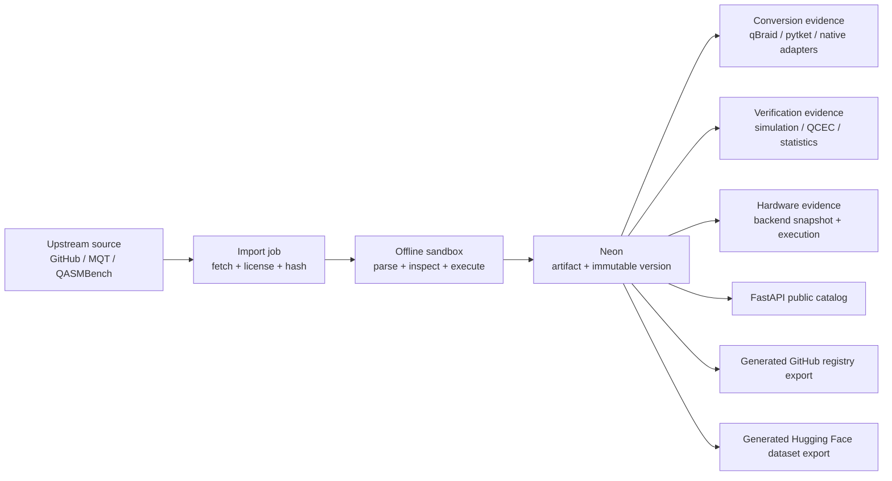

# Quantum Repository Platform - working implementation plan

Status: proposed  
Owner lane: Rei / backend repository and catalog ingestion  
Prepared: 2026-07-18  
Target branch: `feature/repository`

## 1. Outcome

Build a quantum-artifact repository with the collaboration and version history of GitHub,
the searchable cards and dataset exports of Hugging Face, and quantum-specific evidence that
neither platform models directly:

- framework-native executable source and immutable versions;
- explicit cross-framework conversion paths and compatibility warnings;
- source, citation, license, and review provenance;
- simulator and real-QPU execution evidence;
- hardware calibration snapshots and run-specific performance;
- a Neon-backed FastAPI catalog that is the only application database interface.

The first release contains **150 accepted, unique catalog entries**, not 150 separate GitHub
repositories. One entry is a logical artifact with versions, source records, framework variants,
verification evidence, and hardware runs beneath it. GitHub and Hugging Face are connectors and
distribution surfaces; Neon is the source of truth.

## 2. Current state and the gap

The repository already has more of the foundation than the meeting notes imply:

- `apps/web/lib/repository/*` contains 78 validated static entries: 29 gates, 26 algorithms,
  10 operators, and 13 states.
- `artifacts` and immutable `artifact_versions` already hold identity, visibility, native code,
  fingerprint, optional OpenQASM, framework variants, resource estimates, and limitations.
- the FastAPI repository layer is already the only database caller and enforces workspace scope;
- the API already uses async SQLAlchemy against a Neon pooled connection;
- the worker already has durable jobs and deny-all sandbox execution;
- verification has a four-tier classification, but it currently lives in TypeScript catalog data;
- there is no Neon-backed public catalog read API, normalized source/license/citation model,
  import pipeline, conversion evidence model, or hardware-performance model.

The implementation should therefore migrate and extend the existing model rather than create a
second catalog system.

## 3. Non-negotiable design decisions

1. **Framework-native source remains authoritative.** Per ADR-0013 and ADR-0014, the exact
   Qiskit, Cirq, or PennyLane source that was executed and verified is the durable authority.
   OpenQASM is optional interchange and an ingestion bridge, never a silent replacement.
2. **Conversions are derived evidence.** A converted variant never overwrites its source. Store
   every conversion attempt, path, dependency version, warning, output fingerprint, and result.
3. **Neon is the canonical index.** Generated GitHub manifests and Hugging Face Parquet files are
   reproducible exports of accepted Neon records, not independently editable sources of truth.
4. **Provenance is immutable and pinned.** Import a Git commit SHA, release tag, package version,
   file path, retrieval timestamp, and SHA-256. Never store only a mutable `main` URL.
5. **License and citation are different.** A citation is scholarly attribution, not permission to
   redistribute. Preserve SPDX expressions, license text/evidence, copyright notices, and source
   URLs separately from DOI/arXiv references.
6. **Missing evidence is explicit.** `not_run`, `unsupported`, and `inconclusive` are valid states.
   Missing hardware results must never appear as zero performance.
7. **Untrusted imports do not execute in FastAPI.** Network retrieval is performed by a bounded
   fetcher; parsing, conversion, and execution occur in an ephemeral deny-all sandbox.
8. **No public release by automation.** Publishing a GitHub mirror, Hugging Face dataset, or paid
   QPU run remains an owner-approved action.

## 4. Product model

The user-facing mental model is:

- **Entry** - stable slug and conceptual identity, similar to a GitHub/HF repository page.
- **Version** - immutable executable source revision.
- **Variant** - a derived representation in another framework or interchange format.
- **Evidence** - a conversion, verification, simulation, or QPU execution bound to exact hashes.
- **Card** - bilingual documentation, intended use, limitations, license, citations, and metrics.

## 5. Neon data model

Reuse `artifacts` and `artifact_versions`. Add normalized side tables rather than placing every
filterable or repeatable fact into the existing `metadata` JSONB column.

| Table | Purpose | Important fields / constraints |
|---|---|---|
| `artifact_sources` | Exact upstream origin for a version | `artifact_version_id`, source kind, repo URL, commit SHA/tag, path, package version, retrieval time, source SHA-256; unique source identity |
| `license_assertions` | Reviewable redistribution decision | SPDX expression, detected value, declared value, evidence URL/path/hash, confidence, reviewer, decision, reviewed time |
| `artifact_citations` | Papers, datasets, specifications | identifier type, DOI/arXiv/URL, relation type, title, authors, year; DataCite-style relations |
| `artifact_tags` | Stable faceted search | artifact ID + controlled tag; unique pair |
| `import_jobs` | Durable batch-level state | provider, upstream ref, idempotency key, requested/accepted/rejected counts, state, timestamps |
| `import_items` | Per-source quarantine and audit | job ID, upstream identity, state, failure code, raw metadata JSONB, resulting version ID |
| `conversion_attempts` | One directed conversion result | source version/hash, target framework/version, engine/version, ordered path JSONB, options, output hash, status, loss report, duration |
| `artifact_verifications` | Version-bound correctness evidence | version/hash, method, tier, verifier/version, environment fingerprint, parameters, decision, metrics, logs reference |
| `hardware_backends` | Provider/backend identity | provider, backend ID, device family, region, simulator flag, qubit count; unique provider/backend pair |
| `backend_snapshots` | Immutable time-varying calibration | backend ID, captured/calibrated time, native gates, coupling map, raw payload JSONB, extracted summary metrics |
| `hardware_executions` | Run-specific real-device evidence | version/hash, conversion ID, snapshot ID, shots, compile policy, layout, transpiled metrics, queue/compile/run times, result, quality metrics |

Implementation details:

- keep provider-specific payloads in versioned JSONB, but promote searchable/comparable values to
  typed columns;
- add `metadata_schema_version` to imported metadata;
- use UUIDv7 keys and cursor pagination, matching the current repository layer;
- retain canonical source and small circuit text in Postgres for the first 150 entries; introduce
  object storage only when payload size or access measurements justify it;
- use a dedicated system catalog workspace so existing workspace scoping remains enforceable;
- resolve the anonymous-public-read scope explicitly before the migration. Do not bypass the
  repository-layer `Scope` invariant as an implementation shortcut;
- migrations require owner/CODEOWNER review and must demonstrate up -> down -> up.

### Search indexes for the first release

- retain trigram search on title and add normalized title/slug search;
- B-tree indexes for category/family, framework, visibility, review state, SPDX expression,
  qubit count, and updated time;
- GIN only for deliberately queried JSONB keys; do not create a generic index for raw provider
  payloads;
- normalized tag rows for facets rather than a JSON string array;
- defer embeddings/vector search until relevance can be evaluated against a fixed query set.

## 6. Metadata contract

Every accepted version exposes the following groups. Fields that do not apply are null with a
reason, not silently absent.

### Identity and documentation

- stable UUID, slug, title, Japanese title, summary, detailed card, category, algorithm family;
- intended use, non-goals, limitations, maturity/review status, tags;
- created, updated, deprecated, and superseded-by timestamps/relations;
- uploader, maintainers, named reviewers, and expert-review status.

### Provenance and rights

- source type: curated, GitHub, package generator, benchmark suite, community, or paper-derived;
- repository owner/name, immutable commit SHA, tag/release, file path, file hash;
- upstream package and version, importer and importer version;
- SPDX license expression plus detection/review state and evidence;
- original authors/copyright holders and required notices;
- DOI, arXiv, URL, citation text, and typed relations such as `IsDerivedFrom`, `Cites`,
  `IsVersionOf`, and `IsReviewedBy`.

### Intrinsic circuit properties

- authoritative framework and exact SDK version;
- source language/format and optional OpenQASM version;
- qubits, classical bits, registers, parameters, width, depth, total gates, 1Q/2Q/multi-Q counts;
- operation histogram, native/observed gate set, measurement count and density;
- mid-circuit measurement, reset, classical conditions/control flow, delay/timing, pulse calibration,
  noise channels, custom gates, and symbolic-parameter feature flags;
- QASMBench-derived structural metrics where well-defined: gate density, retention lifespan,
  measurement density, and entanglement variance;
- canonical source fingerprint and semantic/family fingerprint for duplicate detection.

### Conversion evidence

- source and target framework + versions;
- conversion engine (`native`, `qbraid`, `pytket`) and exact version;
- ordered conversion path, e.g. `qiskit -> qasm3 -> braket`;
- dependency/environment fingerprint, options, seed, input/output hashes, duration;
- feature support matrix before conversion;
- status: `exact`, `global_phase`, `observational`, `lossy`, `unsupported`, or `failed`;
- warnings for bit order, angle units, implicit swaps, measurements, conditions, unsupported gates,
  dropped metadata, and changed register structure;
- total/partial equivalence result and verifier evidence ID.

### Verification evidence

- existing Tier 1-4 method taxonomy, moved into shared Python contracts;
- exact simulator/backend and version, seed, shots, tolerances, environment/container digest;
- expected result, observed result, raw counts/artifact reference;
- state/process fidelity, total variation distance, Hellinger fidelity, expectation error, or
  invariant results as appropriate;
- decision (`pass`, `fail`, `inconclusive`) and residual risks;
- exact source fingerprint binding so repaired or converted code cannot reuse stale evidence.

### Real-hardware metadata and performance

Separate **device calibration** from **this artifact's execution**.

Device snapshot:

- provider/backend ID, device family/generation, simulator flag, operational state;
- total/available qubits, basis gates, coupling map/topology, dynamic-circuit capabilities;
- calibration timestamp and collection timestamp;
- per-qubit T1, T2, frequency, readout error, asymmetric readout probabilities, readout duration;
- per-instruction/per-edge error and duration, native 2Q operation;
- provider-published metrics when available: Quantum Volume, CLOPS, layer fidelity/EPLG;
- raw provider payload and units. Provider-specific metrics must not be presented as universally
  comparable without matching methodology.

Execution:

- requested and transpiled circuit hashes, compile SDK/pass manager/optimization level/seed;
- initial/final layout, routing, native gate counts, depth, 2Q count, SWAP count;
- shots, job/provider IDs, submission/start/end times, queue/compile/execution wall time;
- mitigation/suppression options, dynamic decoupling, twirling, and resilience settings;
- raw counts/expectations plus success probability, TVD/Hellinger fidelity versus ideal, and
  application-specific score;
- calibration snapshot ID and a disclosure if calibration and execution times differ materially;
- cost only when allowed and explicitly captured; never infer it.

Fair comparisons require the same logical circuit version, target definition, shot count,
compiler policy, scoring function, and nearby calibration window. Store raw evidence so derived
rankings can be recomputed.

## 7. Ingestion pipeline

1. **Discover** a pinned upstream release/commit and enumerate candidate files/configurations.
2. **Fetch** over a bounded allowlisted connector; record HTTP metadata, ETag, commit, path, and
   SHA-256.
3. **License gate** using declared license, GitHub License API as a hint, SPDX normalization, and
   manual review for mismatch/unknown. Unknown rights stay quarantined.
4. **Parse offline** in a deny-all sandbox with pinned dependencies and size/time limits.
5. **Observe** circuit structure through the framework adapter; preserve the exact source.
6. **Normalize metadata** without converting the authoritative source.
7. **Deduplicate** first by source identity, then exact fingerprint, then semantic similarity for
   reviewer assistance. Semantic matches are not auto-merged.
8. **Verify** using the strongest bounded method that fits the circuit.
9. **Convert** only requested target formats, recording unsupported/lossy results explicitly.
10. **Stage** the entry and all evidence; no partial record becomes public.
11. **Review** license, citation, metadata, and verification outcomes.
12. **Publish** atomically by switching review/visibility state.

Each item is independently retryable. Import jobs may finish `completed_with_rejections`; rejected
items retain machine-readable failure codes. The combination of provider + immutable upstream
identity + importer version is an idempotency key.

## 8. First 150 entries

The acceptance target is 150 unique, published artifacts after fingerprint deduplication.

| Cohort | Target | Selection |
|---|---:|---|
| Existing Majorana static catalog | 78 | Migrate all after schema, source, and license audit |
| MQT Bench | 36 | 18 algorithm families x 2 useful sizes; prefer algorithm-level Qiskit generators and diversity across simulation, search, optimization, arithmetic, QML, and states |
| QASMBench | 36 | Small/medium OpenQASM 2 circuits that parse reproducibly, have clear BSD provenance, and fit bounded verification |
| **Total** | **150** | Exact duplicates do not count; pull replacements from the same reviewed candidate pool |

MQT import rules:

- pin `mqt.bench` and generator parameters;
- generate a minimal Qiskit-native source wrapper that binds `FINAL_CIRCUIT`;
- record benchmark family, size, abstraction level, target/gateset when applicable;
- do not count multiple abstraction levels of the same exact circuit as separate entries when they
  are better represented as variants/versions.

QASMBench import rules:

- preserve the original OpenQASM 2 file and upstream hash as source evidence;
- create a Qiskit-native executable wrapper using the official Qiskit OpenQASM 2 loader;
- optional OpenQASM 3 output is a derived interchange variant;
- carry BSD license evidence, NOTICE, benchmark reference, original routine citation, and
  QASMBench structural metrics;
- prefer small/medium circuits for the first release; do not publish huge circuits merely to hit
  the numerical target.

Acceptance criteria per entry:

- immutable source identity and SHA-256;
- reviewed SPDX assertion and required notice/citation;
- deterministic parse and resource observation in the pinned environment;
- complete required metadata and a unique catalog slug/fingerprint;
- at least one non-LLM verification method, or an explicit non-verified review state;
- no conversion is marked supported without stored conversion and equivalence evidence;
- API round-trip and generated export validation pass.

## 9. Framework interoperability strategy

Use three layers instead of selecting one universal converter:

1. existing Majorana native adapters for authoritative Qiskit/Cirq/PennyLane execution;
2. qBraid's directed conversion graph for path discovery and broad format coverage;
3. pytket extensions for explicit two-way SDK conversion, target rebasing, and an independent
   conversion implementation.

The two external tools are complementary evidence providers. Disagreement is valuable evidence,
not a reason to choose whichever output looks successful.

Initial matrix:

| Source | Targets in MVP | Primary path | Required checks |
|---|---|---|---|
| Qiskit | Cirq, PennyLane, Braket, PyQuil, OpenQASM 3 | native/qBraid; pytket cross-check where available | bit order, register/measurement preservation, total or partial equivalence |
| Cirq | Qiskit, Braket, OpenQASM | qBraid/native adapter | moments vs sequential semantics, measurement keys, custom gates |
| PennyLane | Qiskit/OpenQASM when supported | explicit adapter only | tape/measurement semantics, observables, trainable parameters |
| OpenQASM 2 import | Qiskit authoritative wrapper, optional QASM 3 | official Qiskit loader/exporter | include/custom gate resolution, conditions, measurement mapping |
| pytket | Qiskit/Braket/Cirq/PyQuil/QIR where extensions support it | pytket extension | opposite Qiskit/tket qubit ordering, implicit swaps, symbolic limits |

Conversion verification ladder:

- parse/feature inventory before conversion;
- output parse and resource delta report;
- exact unitary comparison for small unitary circuits;
- MQT QCEC total equivalence, including global-phase result;
- QCEC partial/observational equivalence for measured/ancilla circuits;
- fixed-seed statevector or sample-distribution comparison when formal checking is out of bounds;
- fail closed with `unsupported` or `inconclusive` when dynamic control, pulse calibration, noise,
  externs, or framework-specific observables cannot be preserved.

OpenQASM 3 supports classical feed-forward, explicit timing, externs, and calibration constructs,
but a language specification does not imply every SDK implements every construct. Capability must
be measured per tool/version and stored with the attempt.

## 10. FastAPI surface

Public reads:

- `GET /v1/repository` - cursor pagination, full-text query, facets;
- `GET /v1/repository/{slug}` - current card and evidence summary;
- `GET /v1/repository/{slug}/versions`;
- `GET /v1/repository/{slug}/versions/{seq}`;
- `GET /v1/repository/{slug}/exports/{framework}` - only stored, evidenced variants;
- `GET /v1/repository/{slug}/conversions`;
- `GET /v1/repository/{slug}/hardware-runs`;
- `GET /v1/backends/{provider}/{backend_id}/snapshots`.

Admin/service mutations:

- `POST /v1/imports` with `Idempotency-Key`;
- `GET /v1/imports/{id}` and per-item failures;
- `POST /v1/repository/{id}/conversion-jobs`;
- `POST /v1/repository/{id}/verification-jobs`;
- `POST /v1/repository/{id}/hardware-jobs` only after credential/spend approval;
- `POST /v1/integrations/github/webhooks` with signature and delivery-ID validation.

Filters should include category/family, framework, source suite, SPDX license, verification tier,
review state, qubit range, dynamic-feature flags, hardware-tested state, and evidenced conversion
target. Mutations use RFC 9457 errors, typed contracts, cursor pagination, and scoped repository
functions consistent with the existing API.

## 11. Neon and operational practices

- keep the pooled Neon connection for FastAPI and workers; PgBouncer transaction mode means short
  transactions and no session `SET`, `LISTEN/NOTIFY`, session advisory locks, or session temp state;
- use a direct Neon connection for Alembic and administrative tooling;
- retain `pool_pre_ping`; bound application pool size per Cloud Run instance and monitor both
  client and server pool connections;
- run import work through the existing durable job model, never inside a request lifecycle;
- batch discovery, but commit/quarantine items independently so one malformed circuit cannot roll
  back the complete import;
- use explicit timeouts and exponential backoff for external APIs, not database retries around
  arbitrary non-idempotent work;
- aggregate/filter in Postgres rather than transferring raw provider JSON for list pages;
- test cross-workspace/public leakage, idempotent retries, concurrent version creation, pagination,
  and deletion/deprecation behavior.

## 12. GitHub and Hugging Face integration

### GitHub

Use GitHub as an upstream source and optional generated registry mirror. Do not create 150
independent repositories in the first release.

- prefer a GitHub App with minimum metadata/contents permissions over a personal token;
- pin imports to commit SHA and use Contents/Trees APIs according to repository size;
- save ETag/Last-Modified and use conditional requests;
- avoid polling; use signed webhooks for subscribed repositories;
- validate `X-Hub-Signature-256`, deduplicate `X-GitHub-Delivery`, return 2xx quickly, and process
  asynchronously;
- process API work serially through a queue and honor Retry-After/rate-limit headers;
- treat GitHub's Licensee/SPDX result as detection evidence, not final legal approval;
- optional generated mirror layout: `entries/<slug>/manifest.json`, card, source, variants,
  evidence summaries, `CITATION.cff`, and license notices.

### Hugging Face

Publish one mixed-license **dataset repository** after owner approval, not one repository per
circuit. Use a dataset card and Parquet-friendly tables:

- `circuits` config: one row per accepted immutable version;
- `conversions` config: one row per conversion attempt/evidence record;
- `hardware_runs` config: one row per real/simulator execution;
- `backend_snapshots` config: calibration snapshots with large raw payloads moved to separate files;
- README dataset card with intended use, limitations, creation process, update policy, citations,
  and mixed-license explanation;
- per-row SPDX/source fields and bundled notices; use a dataset-level `other` license marker when
  one license cannot truthfully cover every row;
- keep very large code/raw JSON values out of the first viewer rows and use sensible Parquet row
  groups/page indexes;
- tag releases and include the Neon export watermark/schema version so a dataset can be reproduced.

## 13. Real-QPU pilot

Hardware testing is a separate, owner-approved milestone because it may require credentials and
spend. It does not block publication of metadata-complete entries.

Pilot with roughly 12 small, interpretable circuits (Bell/GHZ at several sizes, BV,
Deutsch-Jozsa, small QFT/Grover/QAOA) on at least two accessible backends if terms and budget allow.
For every run:

- capture the backend calibration snapshot immediately before submission;
- record exact transpilation and mitigation policy;
- compare against ideal simulation using an algorithm-appropriate score;
- repeat enough to show uncertainty rather than a single lucky result;
- display calibration time and execution time together;
- label provider metrics and methodology instead of combining them into an unsupported universal
  ranking.

## 14. Delivery sequence

Each item should be a focused PR from `feature/repository` and receive Claude/owner review before
merge, especially contracts, migrations, auth, and sandbox changes.

### PR 1 - Contracts and schema proposal

- finalize catalog/public scope decision and metadata JSON schema;
- add typed contracts and reversible migrations for sources, rights, imports, conversions, and
  verification evidence;
- add indexes and authz/raw-query tests;
- demonstrate up -> down -> up.

Definition of done: schema review approved; generated OpenAPI/TypeScript contracts current; DB,
authz, and import-linter checks pass.

### PR 2 - Public repository reads

- implement repository-layer list/detail/version/evidence reads;
- add public-safe response mapping, facets, search, cursor pagination, cache headers;
- ensure no private workspace data can enter public results.

Definition of done: API contract and cross-workspace matrix tests pass; no UI work required.

### PR 3 - Durable importer

- add import job/item repositories and worker handler;
- implement bounded GitHub/package/file fetch adapters, license quarantine, hashing, parser limits,
  idempotency, retry, and audit events;
- produce a dry-run manifest without Neon writes.

Definition of done: retrying a job creates no duplicate versions; malformed/unlicensed candidates
are quarantined with stable codes; sandbox has deny-all egress.

### PR 4 - Migrate existing 78

- transform TypeScript entries into reviewed manifests;
- reconcile source/license/citation data and preserve slugs;
- import into a Neon test branch and compare API output against the static catalog;
- leave the current renderer untouched until owner approves the data-source cutover.

Definition of done: exactly 78 accepted unique records, zero unexplained field loss, validator and
focused API tests pass.

### PR 5 - Reach 150

- implement pinned MQT Bench and QASMBench adapters;
- select 36 + 36 candidates with replacement pools;
- parse, fingerprint, deduplicate, verify, review, and import;
- generate an acceptance report containing every accepted/rejected source and real command result.

Definition of done: exactly 150 accepted unique public records; every record has rights evidence,
provenance, structural metrics, and verification/review state; no invented benchmark result.

### PR 6 - Interoperability evidence

- integrate qBraid conversion graph and pytket cross-checks behind optional worker dependencies;
- store conversion paths, compatibility features, warnings, output hashes, and QCEC evidence;
- create a fixed conversion corpus covering measurements, parameterized gates, custom gates,
  bit-order differences, implicit swaps, and unsupported dynamic constructs.

Definition of done: support claims are generated only from stored passing attempts; loss and
unsupported states are visible and tested.

### PR 7 - Exports and hardware evidence

- deterministic GitHub registry and Hugging Face Parquet/card export;
- backend snapshot and execution ingestion;
- owner-approved QPU pilot, or explicitly report it as not run.

Definition of done: exports reproduce from a Neon watermark; checksums match; public/spend actions
occur only with approval.

## 15. Test and quality gates

- unit: schema validation, SPDX parsing, fingerprint stability, conversion status, metric units;
- property/golden: importer normalization and deterministic export;
- integration: FastAPI -> repository -> temporary Neon branch;
- authz: public/private and cross-workspace matrix;
- migration: up -> down -> up plus seed/import smoke test;
- sandbox: deny-all egress, time/memory/output limits, malicious import fixtures;
- conversion: exact, global-phase, partial, lossy, unsupported, timeout, and dependency-missing cases;
- provenance: commit/path/hash and citation relation round-trip;
- hardware: calibration timestamp binding, unit normalization, absent metric handling;
- acceptance: 150 unique fingerprints, source/license coverage, no unreviewed public records;
- standard repo gates: Ruff, format, pytest, import-linter, raw-query guard, generated contracts.

## 16. Risks and explicit owner decisions

1. **Public scope model:** approve a dedicated catalog workspace/service scope before schema work.
2. **License policy:** decide which SPDX expressions are auto-acceptable and who reviews unknown,
   custom, or paper-derived circuits.
3. **Static-to-API cutover:** decide when the UI stops importing TypeScript records; backend work can
   finish first.
4. **Framework expansion:** current durable execution supports Qiskit, Cirq, and PennyLane.
   Braket, PyQuil, CUDA-Q, and pytket should initially be stored as derived/unsupported variants
   until execution contracts are owner-approved.
5. **GitHub/HF publication:** public account/org/repository creation needs explicit approval.
6. **QPU access and spend:** backend choice, credentials, result-redistribution terms, and budget
   must be approved before running hardware jobs.
7. **Provider comparison:** do not ship a single cross-provider score until the methodology has a
   versioned specification and uncertainty treatment.
8. **Plan authority gap:** the external `Documents/Projects/Majorana/plans` and memory files named
   in repository instructions were not available in this environment; this is a working plan and
   should be reconciled with the authoritative plan before implementation.

## 17. Research basis

Primary documentation and project sources consulted on 2026-07-18:

- [MQT Bench](https://www.cda.cit.tum.de/mqtbench/index) and
  [MQT Bench documentation](https://mqt.readthedocs.io/projects/bench/en/latest/)
- [QASMBench](https://github.com/pnnl/QASMBench)
- [NWQBench](https://github.com/pnnl/nwqbench)
- [QED-C application-oriented benchmarks](https://github.com/SRI-International/QC-App-Oriented-Benchmarks)
- [Qiskit Benchpress](https://github.com/Qiskit/benchpress)
- [qBraid transpiler](https://docs.qbraid.com/v2/sdk/user-guide/transpiler)
- [pytket user guide](https://docs.quantinuum.com/tket/user-guide/) and
  [pytket-Qiskit conversion API](https://docs.quantinuum.com/tket/extensions/pytket-qiskit/api.html)
- [MQT QCEC](https://mqt.readthedocs.io/projects/qcec/en/stable/) and
  [partial equivalence](https://mqt.readthedocs.io/projects/qcec/en/stable/partial_equivalence.html)
- [OpenQASM 3 specification](https://openqasm.com/intro.html)
- [IBM backend/calibration properties](https://quantum.cloud.ibm.com/docs/en/guides/qpu-information)
- [Neon connection pooling](https://neon.com/docs/connect/connection-pooling)
- [Hugging Face dataset cards](https://huggingface.co/docs/hub/en/datasets-cards),
  [repositories](https://huggingface.co/docs/hub/en/repositories), and
  [Parquet dataset viewer](https://huggingface.co/docs/dataset-viewer/parquet)
- [GitHub REST API best practices](https://docs.github.com/en/rest/using-the-rest-api/best-practices-for-using-the-rest-api),
  [webhook best practices](https://docs.github.com/en/webhooks/using-webhooks/best-practices-for-using-webhooks),
  and [license API](https://docs.github.com/en/rest/licenses/licenses)
- [SPDX specification](https://spdx.dev/use/specifications/),
  [DataCite related identifiers](https://datacite-metadata-schema.readthedocs.io/en/4.6/properties/relatedidentifier/),
  and [CodeMeta terms](https://codemeta.github.io/terms/)

