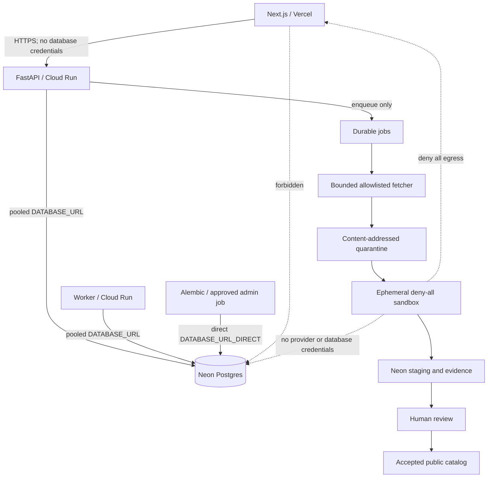

# Quantum Repository Platform - staged implementation plan

Status: Steps 2-5a implemented and validated; Step 5b development may proceed without CODEOWNER review or a PR  
Owner lane: Rei / Neon catalog, FastAPI repository API, classification, and ingestion  
Prepared: 2026-07-18  
Target branch: `feature/repository`  
Development authority: Rei on a feature branch; production/public actions remain owner-controlled

> **Amendment, 2026-07-19 — the corpus is 283 records, not 285.** The owner removed
> `grover-4bit-search` and `simon-query-circuit` (the two community submissions the
> first-party CC-BY-4.0 grant of Slice C.5 could not reach) from the source corpus rather
> than carrying them as permanently-private records. Every "285" below should be read as
> **283**, and the 29/60/13/183 category breakdown as 29/60/13/**181**. The counts were never
> asserted by the pipeline — they are derived from the assembled entries — so this changes no
> mechanism, only the figures. See `docs/adr/0019-pinned-catalog-bootstrap.md`.

## 1. Fixed decisions

This plan supersedes the earlier catalog plan for `feature/repository`.

1. Neon Postgres is the canonical catalog database.
2. API and Worker are the only application processes allowed to read or write Neon. Both use
   the repository layer owned by `services/api`; Next.js and sandboxed code never connect.
3. The 285 records validated on the pinned `origin/dev` baseline are the default bootstrap input
   for Neon. They pass through the same importer, hashing, rights, review, and evidence gates as
   every other source; their TypeScript status text is not trusted as execution evidence.
4. A fresh development or preview catalog can idempotently stage all 285 bootstrap records through
   an explicit post-migration command. Application startup and Alembic never seed or publish them.
5. Work lands in small, independently verifiable commits on a `feature/*` branch. A PR or
   CODEOWNER review is not a prerequisite for Step 5b development.
6. Existing application invariants remain in force: repository-layer scoping, immutable artifact
   versions, framework-native authority, deny-all execution sandboxes, generated contracts, and
   reversible migrations.
7. After bootstrap, Neon is authoritative. Later TypeScript changes require a new pinned manifest
   and explicit import job; there is no runtime fallback or continuous dual-source synchronization.
8. Nothing is published externally, deployed, pushed to a protected branch, or executed on a paid
   QPU without the required owner approval.

The TypeScript catalog is a pinned bootstrap source and temporary legacy UI surface:

```text
apps/web/lib/repository/*
        |
        +-- validator proves exactly 285 source records on the pinned baseline
        +-- deterministic manifest -> normal importer -> staged Neon records
        +-- no direct SQL copy, migration seed, startup seed, or evidence promotion
        +-- after import, public reads and exports use Neon only
```

## 2. Outcome and measurable acceptance

Build a quantum-artifact repository with:

- GitHub-style stable identity, provenance, review, and immutable revisions;
- Hugging Face-style searchable cards and deterministic dataset exports;
- quantum-specific framework, conversion, verification, and later hardware evidence;
- a Neon-backed FastAPI catalog that remains compatible with the current Leona Quantum architecture.

The 285-record bootstrap milestone is complete only when all of the following are true:

- exactly 285 source items were recorded by one pinned, schema-versioned bootstrap manifest;
- every source item has a durable terminal or review state in Neon, including rejected or
  quarantined items, so failures cannot disappear from the report;
- exact duplicates do not count;
- every accepted entry has immutable source identity, hashes, classification, reviewed rights
  state, and citations where required;
- at least 80 entries contain executable framework-native circuit source;
- at least 60 entries parse and re-execute in the pinned environment;
- at least 40 entries have stored non-LLM correctness evidence;
- no framework or conversion is advertised as tested without a stored attempt bound to exact
  input and output hashes;
- missing simulator, conversion, or QPU evidence is shown as `not_run`, `unsupported`, or
  `inconclusive`, never inferred as success or zero performance;
- public reads return only accepted records in the dedicated catalog scope;
- private workspace artifacts cannot appear in catalog reads, search, cache entries, or exports.

Before importing the full 285, a representative 20-entry slice of the same pinned manifest must
demonstrate the complete path:

```text
pinned upstream source or controlled upload
    -> FastAPI import request
    -> durable job and item records
    -> bounded fetch into quarantine
    -> deny-all offline parse and observation
    -> classification, rights, provenance, and fingerprint gates
    -> Neon staging records
    -> human review and audited publication
    -> public FastAPI list/detail read
    -> feature-flagged web proof
```

The proof batch must include a Qiskit-native circuit, OpenQASM 2 import, measurements,
parameters, an exact duplicate, a malformed item, an unknown-license item, an unsupported item,
and at least two verification states.

## 3. Compatibility with the current repository

### 3.1 Reuse rather than replace

The implementation extends these existing components:

| Existing component | Reuse rule |
|---|---|
| `services/api` | Owns the only repository layer used by the database-facing API and Worker processes |
| `services/api/src/majorana_api/repos` | All catalog SQL and ORM access stays here and takes scoped authority first |
| `artifacts` | Stable identity in a dedicated system catalog workspace |
| `artifact_versions` | Immutable framework-native source revisions |
| `jobs` and Worker dispatch | Durable asynchronous import/verification/conversion work |
| `verification_records` | Existing run evidence remains valid and is linked rather than silently copied |
| `packages/py/contracts` | Source of truth for shared API types; changes remain additive within `/v1` |
| generated TypeScript contracts | Regenerated from OpenAPI; never hand-edited |
| `packages/py/frameworks` | Authoritative Qiskit, Cirq, and PennyLane execution adapters |
| `packages/py/openqasm` | Optional normalized interchange and OpenQASM fingerprint support |
| `packages/py/sandbox` | Deny-all execution boundary for untrusted parse/execute operations |

The implementation must not create:

- a second catalog database;
- direct Neon access from Next.js;
- a separate unscoped ORM path;
- a second framework execution system;
- another source of truth in GitHub or Hugging Face;
- a fallback that combines TypeScript and Neon records in one public result set;
- direct database seeding from TypeScript modules, Alembic, or application startup.

### 3.2 Known integration gaps to resolve explicitly

The current code has the following constraints. Each is addressed in a separate slice rather than
hidden inside a large migration.

- FastAPI and Worker already use the pooled `DATABASE_URL`, but Alembic currently reads
  `DATABASE_URL`; migration configuration must explicitly introduce or map
  `DATABASE_URL_DIRECT`.
- `WorkspaceKind` currently has only personal and team values, and every workspace requires an
  owner user. The system catalog identity and service principal need an approved design.
- normal repository reads require a user `Scope`; anonymous-safe catalog reads do not yet exist.
- `Framework` currently supports Qiskit, Cirq, and PennyLane. OpenQASM imports therefore preserve
  original QASM as provenance and use an evidenced supported loader for authoritative execution.
- artifact fingerprint uniqueness currently applies within one artifact, not across the public
  catalog. Global exact deduplication needs its own constraint or deduplication ledger.
- the job queue can claim jobs, but long import work needs an explicit lease, heartbeat, stale-job
  recovery, retry classification, and dead-letter behavior.
- the current `/v1/artifacts/import-public` endpoint copies a legacy public record into a private
  workspace. It remains untouched until the new catalog API has a replacement with equivalent
  user behavior.

## 4. System boundaries and authority



### 4.1 Catalog principals

Before schema work, record an ADR choosing the concrete authority model. It must provide:

- one dedicated catalog workspace or equivalent explicit catalog boundary;
- a non-human service identity for importer mutations;
- a public-read authority that cannot access personal or team workspaces;
- no user-controlled way to select the catalog workspace ID;
- separate import, review, and publish permissions;
- owner/admin authority for publication and quarantine release;
- audit records for import request, rights decision, review, publication, retraction, and export.

The design must preserve the repository-layer scope invariant. It must not fabricate arbitrary
normal-user scopes in request handlers or bypass workspace predicates.

### 4.2 Database connections

- API and Worker use the pooled Neon URL, short transactions, one session per request/job unit,
  `pool_pre_ping`, and bounded per-instance pools.
- Alembic and approved administrative tools use the direct Neon URL.
- Pooled traffic must not rely on session `SET`, session advisory locks, `LISTEN/NOTIFY`, or
  persistent temporary state.
- Application startup never mutates the schema.
- Secrets remain server-side and are never serialized into job payloads, logs, catalog records,
  browser responses, or sandboxes.

## 5. Minimal catalog model

Add data only when a phase needs it. Prefer typed columns for stable filters and versioned JSONB
only for provider- or tool-specific payloads.

### 5.1 Identity and publication

Add to `artifacts`:

- `artifact_kind`: `circuit`, `gate`, `algorithm_template`, `state_preparation`, `operator`,
  `benchmark_instance`, or `literature_method`;
- `execution_state`: `executable`, `template_only`, `documentation_only`, or `unsupported`;
- `review_state`: `draft`, `quarantined`, `pending_review`, `accepted`, or `rejected`;
- `publication_state`: `private`, `staged`, `public`, `retracted`, or `deprecated`;
- bilingual summaries only when the public API/UI phase needs them.

Add to `artifact_versions`:

- `metadata_schema_version`;
- authoritative framework and exact SDK version;
- source language/format;
- `source_blob_sha256`;
- `normalized_source_hash`;
- `semantic_fingerprint` plus algorithm/version;
- toolchain/environment digest.

Hash meanings must never be overloaded:

```text
source_blob_sha256       exact retrieved bytes
normalized_source_hash   deterministic normalized source
semantic_fingerprint     reviewer aid for quantum/logical similarity
```

Only exact hashes can automatically reject a duplicate. Semantic matches create a review task and
must not auto-merge entries.

### 5.2 Provenance and rights

| Table | Purpose |
|---|---|
| `artifact_sources` | Pinned source kind, repository, commit/release, path, package version, retrieval metadata, and content hash |
| `license_assertions` | Append-only declared/detected SPDX, evidence hash, file/variant scope, confidence, reviewer decision, superseded assertion |
| `artifact_citations` | DOI, arXiv, URL, specification, authors, year, and typed relation |
| `artifact_tags` | Controlled faceted tags with a unique artifact/tag pair |

License review and citation are separate. A citation does not grant redistribution permission.
Unknown, conflicting, custom, or missing rights remain quarantined until an authorized reviewer
records a decision.

### 5.3 Import control plane

| Table | Purpose |
|---|---|
| `import_jobs` | Provider, pinned upstream ref, idempotency key, state, lease, heartbeat, counts, timestamps |
| `import_items` | Stable upstream identity, state, failure code, raw metadata, exact hashes, resulting version |

Required terminal or intermediate states include:

```text
queued -> fetching -> quarantined -> parsing -> staged -> pending_review -> accepted
                                                                  \-> rejected
any active state -> retry_wait -> active
any active state -> dead
```

Jobs may finish `completed_with_rejections`. Each item commits or quarantines independently so one
bad input cannot roll back or publish an entire batch.

### 5.4 Evidence

| Table | Purpose |
|---|---|
| `artifact_verifications` | Version-bound public evidence, with an optional link to the existing run and verification record |
| `conversion_attempts` | Directed conversion input/output hashes, tools, versions, path, warnings, status, and verifier link |

Verification states:

```text
not_run
documented
literature_attested
reexecuted
formally_verified
hardware_reproduced
inconclusive
failed
```

Conversion labels remain separate from framework support:

```text
native
stored_variant
generated_subset
import_recipe
executed_conversion
equivalence_checked
lossy
unsupported
failed
```

Only `native`, `executed_conversion`, or `equivalence_checked` with matching stored evidence may be
presented as tested support. A qBraid path, pytket extension, generated snippet, or loader recipe is
not by itself evidence of equivalence.

Hardware tables are deferred until after the 285-record software catalog bootstrap is reviewed.
Until then, QPU evidence is `not_run`. Provider interfaces may be designed, but no credentials,
paid calls, or hardware performance claims are part of this milestone.

## 6. Import and publication pipeline

1. **Receive** a typed FastAPI request with an idempotency key and a supported connector ID, not an
   arbitrary execution command.
2. **Authorize** the caller and create durable job/item records in one short transaction.
3. **Resolve** a commit SHA, release, package version, or benchmark configuration.
4. **Fetch** through the bounded connector into content-addressed quarantine.
5. **Record provenance** before parsing: immutable ref, response metadata, exact bytes hash, size,
   retrieval time, and importer version.
6. **Classify rights** from pinned evidence and quarantine unknown or conflicting cases.
7. **Parse offline** in a deny-all sandbox with pinned dependencies and strict resource limits.
8. **Observe** framework-native circuit properties without replacing authoritative source.
9. **Normalize metadata** and classify artifact, execution, and evidence states.
10. **Deduplicate** by immutable source identity and exact hashes; use semantic similarity only to
    assist review.
11. **Verify** with the strongest bounded non-LLM method appropriate for the artifact.
12. **Convert only requested targets** and preserve unsupported, lossy, failed, and inconclusive
    attempts.
13. **Stage atomically** per item in the catalog boundary.
14. **Review** rights, provenance, classification, evidence, and public card content.
15. **Publish** review and publication state together in an audited transaction.

Publication must fail closed if any required source hash, rights decision, reviewer, or exact
version binding is missing.

## 7. Security and systems-engineering controls

### 7.1 External fetch and quarantine

- allowlist schemes, hosts, ports, connector operations, and maximum redirect count;
- reject loopback, private, link-local, multicast, metadata-service, and non-routable destinations;
- revalidate DNS and resolved IP at every connection and redirect to prevent rebinding/TOCTOU;
- enforce connect, read, total-time, response-size, and concurrency limits;
- limit archive compressed size, expanded size, file count, nesting depth, and compression ratio;
- reject absolute paths, traversal, symlinks, device files, executable hooks, implicit Git
  submodules, and implicit Git LFS downloads;
- do not run `git clone` or package installation from an untrusted request in FastAPI;
- store raw bytes by hash and never render untrusted Markdown/HTML without sanitization;
- log accepted and blocked destinations without recording credentials or sensitive query strings.

### 7.2 Sandbox and supply chain

- parsing, conversion, and execution use ephemeral deny-all egress sandboxes;
- sandbox images and Python dependencies are pinned by digest/lockfile;
- CPU, memory, wall time, process count, file count, disk, and output bytes are bounded;
- no Neon, GitHub, Hugging Face, QPU, cloud, or signing credentials enter the sandbox;
- environment image digest, package versions, command/recipe ID, parameters, seed, and input/output
  hashes are stored with evidence;
- dependency updates are reviewed and tested against malicious and compatibility fixtures;
- generated GitHub/Hugging Face exports include schema version, export watermark, and checksums.

### 7.3 Authorization and data isolation

- every catalog repository function applies catalog, review, publication, and deletion predicates
  itself;
- public reads require the conjunction of catalog boundary, `review_state = accepted`, and
  `publication_state = public`;
- private and public response models are distinct so internal review notes and raw payloads cannot
  leak through serialization;
- cross-workspace tests cover list, detail, version, source, evidence, search, export, and cache;
- public cache keys contain no user-specific data; authenticated responses are never cached as
  public;
- import, review, and publish actions are rate limited and audited;
- publication and quarantine release require owner/admin authority and preferably a reviewer other
  than the importer.

### 7.4 Reliability and recovery

- every mutation uses an idempotency key with a database uniqueness constraint;
- jobs use leases, heartbeat, stale-job recovery, bounded retry, exponential backoff, and dead-letter
  handling;
- failure codes distinguish retryable infrastructure failures from permanent data failures;
- one item failure cannot publish partial data or block unrelated items;
- reconciliation checks compare job counts, item states, artifacts, versions, evidence, and exports;
- metrics cover connection errors, pool wait, query latency, queue age, lease expiry, retries,
  quarantine rate, acceptance rate, and sandbox timeout/resource failures;
- alerts and runbooks exist before bulk ingestion begins.

### 7.5 Change and migration safety

- all schema changes are additive until the Neon catalog is stable;
- one migration has one responsibility and a reversible downgrade;
- CI proves `upgrade -> downgrade -> upgrade` on a temporary Neon branch;
- application startup never performs migrations or seed publication;
- backfills are resumable, idempotent jobs, not unbounded migration SQL;
- new API behavior is behind a server-side feature flag until scope and leakage tests pass;
- every phase declares rollback and stop conditions before implementation.

## 8. Initial source strategy

The first source release is the 285-record snapshot validated on the integrated `origin/dev`
baseline: 29 gates, 60 operators, 13 states, and 183 algorithms. The bootstrap manifest records the
source commit, generator version, schema version, deterministic ordering, per-record source hash,
and whole-manifest checksum.

`default` means that a fresh development or preview Neon branch runs an explicit, idempotent
post-migration bootstrap command and receives all 285 import items. It does not mean that records
are silently inserted by Alembic, application startup, or a Next.js process. Production bootstrap
and publication remain owner-approved actions.

Bootstrap rules:

- bundle and validate the catalog from one pinned commit; never read a moving branch during import;
- convert each record to a typed manifest item outside the database transaction;
- submit the manifest through the normal FastAPI/service importer contract;
- preserve the TypeScript slug and bilingual documentation as source data;
- treat existing license strings, verification prose, tier labels, and `verified` status as claims
  requiring normalization and review, not as legal approval or a passing execution;
- create one durable import item for every source record, even when rejected or quarantined;
- use source and normalized hashes for idempotency and exact duplicate handling;
- stage records before review; only accepted/public records appear in anonymous reads;
- after successful import, treat Neon as the only editable catalog authority;
- require a new manifest release and explicit import job for later source changes.

MQT Bench, QASMBench, linked GitHub/Hugging Face projects, and new Leona Quantum-native entries remain
future additive sources after the 285-record bootstrap is stable. They use the same acceptance
contract and cannot lower the rights or evidence bar.

### 8.1 MQT Bench

- pin package version, generator, parameters, size, abstraction level, target, and gate set;
- preserve the generator invocation and environment digest as provenance;
- produce a minimal supported framework-native wrapper exposing the final circuit;
- represent abstraction levels or hardware mappings as versions/variants when they share logical
  identity;
- do not count exact duplicate outputs as separate entries.

### 8.2 QASMBench

- preserve original OpenQASM 2 bytes, commit, path, hash, license evidence, notices, and citation;
- import through a pinned supported loader and store the executable wrapper as a distinct version
  representation with derivation evidence;
- store OpenQASM 3 only as a derived variant after an actual conversion attempt;
- prioritize small and medium circuits that fit bounded parsing and verification;
- do not publish large circuits solely to reach the numerical milestone.

### 8.3 GitHub and Hugging Face

- support a small allowlisted connector set first; do not accept arbitrary repository automation;
- pin commit SHA/release and path, and retain content hashes;
- treat provider license metadata as a detection hint, not legal approval;
- prefer repositories linked from papers or maintained project pages;
- defer general paper-to-circuit extraction because papers may omit executable details;
- use GitHub as an upstream and generated registry, and Hugging Face as one versioned dataset with
  configurations rather than creating one repository per circuit.

## 9. Public FastAPI surface

Introduce endpoints only after the underlying scope and state predicates are tested.

Public reads:

```text
GET /v1/repository
GET /v1/repository/{slug}
GET /v1/repository/{slug}/versions
GET /v1/repository/{slug}/versions/{seq}
GET /v1/repository/{slug}/sources
GET /v1/repository/{slug}/verifications
GET /v1/repository/{slug}/conversions
GET /v1/repository/{slug}/exports/{framework}
```

Controlled mutations:

```text
POST /v1/imports
GET  /v1/imports/{id}
GET  /v1/imports/{id}/items
POST /v1/repository/{id}/verification-jobs
POST /v1/repository/{id}/conversion-jobs
POST /v1/repository/{id}/publish
POST /v1/repository/{id}/retract
```

API rules:

- typed Pydantic contracts and generated TypeScript types;
- RFC 9457-compatible errors;
- cursor pagination with deterministic tie-breaking;
- explicit immutable cache headers and ETags for versions;
- bounded filter combinations and query timeouts;
- no external fetch, parsing, conversion, or execution in an HTTP request lifecycle;
- only stored accepted variants with matching evidence may be exported.

## 10. Small-step delivery plan

Every step is one focused PR or smaller. A step begins only after the previous step's required
checks and review are complete.

### Step 0 - plan, ADRs, and conflict map

Scope:

- approve this plan and record the pinned 285-record TypeScript snapshot as bootstrap input only;
- document catalog authority, public-read scope, fingerprint semantics, publication approval, and
  threat boundaries in ADRs;
- inventory files likely to overlap with Rui, Ryu, Eshaan, contracts, migrations, and web work;
- define API and DB naming before changing shared contracts.

Done when:

- decisions and unresolved owner questions are explicit;
- no runtime or schema behavior changed;
- reviewers agree on file ownership and PR order.

Rollback: revert documentation only.

### Step 1 - queue recovery prerequisite

Scope:

- add job lease, heartbeat, stale recovery, retry classification, and dead-letter behavior;
- preserve current `run.execute` behavior and add regression tests;
- add metrics for queue age, lease expiry, attempts, and terminal failures.

Done when:

- a killed Worker is recovered without duplicate publication or a permanently stuck job;
- existing pipeline E2E remains green;
- Ryu/Eshaan review the shared queue change.

Rollback: disable the reaper/heartbeat path and revert the additive columns; existing job dispatch
continues unchanged.

### Step 2 - Neon connection and catalog authority

Implementation status (2026-07-18): complete on `feature/repository`. Temporary
branch `step2-catalog-authority-20260718` passed 0011→0013→0012→0013,
idempotent authority provisioning, pooled authz tests, and zero-catalog-data checks.
No catalog records were imported. Deployment remains a separate owner-controlled action.

Scope:

- separate pooled application and direct migration configuration;
- implement the approved system catalog identity/service principal mechanism;
- add public-safe catalog authority and cross-workspace leakage tests;
- add connection and scope telemetry.

Done when:

- API and Worker use pooled connections and Alembic uses direct connection;
- Next.js has no Neon credential or database import;
- temporary Neon branch migration and scope matrix pass;
- no catalog data exists yet.

Rollback: feature flag off; revert the catalog principal seed/config and additive migration.

### Step 3 - minimal identity schema and private staging API

Scope:

- add artifact classification, review/publication states, version schema/hash fields, and indexes;
- add private/admin staging repository functions and typed contracts;
- keep all created records non-public;
- prove exact hash stability and global duplicate rejection.

Done when:

- an authorized service can create an immutable staged entry/version;
- normal users cannot access it;
- duplicate and state-transition tests pass;
- no public endpoint or runtime TypeScript dependency is introduced.

Rollback: feature flag off, then reversible migration downgrade while no accepted records exist.

### Step 4 - provenance, rights, citations, and review

Scope:

- add source, license assertion, citation, tag, and audit records;
- implement append-only rights decisions and controlled review transitions;
- implement publication precondition checks without yet publishing records.

Done when:

- unknown/conflicting licenses fail closed into quarantine;
- a new source revision cannot reuse stale review/evidence;
- provenance and rights survive API round-trip with identical hashes;
- importer and reviewer separation is tested.

Rollback: feature flag off; records remain staged and non-public.

### Step 5 - durable importer skeleton and safe fetcher

Split into two independently reviewable slices per decision 5 (§1): 5a has no network
exposure; 5b is where the security surface actually grows.

#### Step 5a - durable importer skeleton (local fixture provider only)

Scope:

- add import jobs/items and one controlled local/file fixture adapter;
- implement idempotency, item-level retry, quarantine, stable failure codes, and limits;
- no network access anywhere in this slice.

Done when:

- retry creates no duplicate version;
- oversized, malformed, and empty fixtures fail safely with stable, distinguishable
  failure codes;
- a crashed import resumes from durable item state;
- rejected items never create public artifacts.

Status: implemented, validated against a throwaway local Postgres 14, and Neon-gated —
see `docs/archive/repository-migration-2026-07/repository-step5a-import-skeleton.md` and `docs/archive/repository-migration-2026-07/repository-step5a-neon-gate.md`.

Rollback: disable import creation and drain/cancel active jobs; staged data remains non-public for
audit or approved deletion.

#### Step 5b - safe fetcher and real sources (not started; independently scoped)

Scope:

- add a deterministic 285-record bootstrap-manifest adapter pinned to an approved source commit;
- implement allowlisted MQT Bench and QASMBench adapters after malicious fixture tests pass;
- SSRF/redirect/archive/path-traversal/timeout hardening for real outbound fetches;
- parse only in deny-all sandboxes.

Done when:

- SSRF, redirect, archive, path traversal, oversized, malformed, and timeout fixtures fail safely;
- everything Step 5a's "done when" list already covers, against the real adapters.

Rollback: disable import creation and drain/cancel active jobs; staged data remains non-public for
audit or approved deletion.

### Step 6 - 20-entry end-to-end proof and public reads

Scope:

- import a representative 20-entry slice from the pinned 285-record bootstrap manifest;
- add reviewed publication transition;
- implement public list/detail/version/source reads with pagination, ETags, and leakage tests;
- expose a feature-flagged proof route or test client without mixing legacy and Neon results.

Done when:

- all 20 decisions have acceptance/rejection reports;
- public responses contain only accepted Neon records;
- private/cross-workspace/cache tests pass;
- rollback to no public Neon route is demonstrated.

Rollback: turn off public catalog feature flag; Neon records and audit history remain intact.

### Step 7 - verification evidence

Scope:

- add version-bound public verification records and links to existing run evidence;
- move only the necessary Tier vocabulary into shared Python contracts;
- implement bounded non-LLM methods for accepted circuit families;
- display `not_run`, `inconclusive`, and `failed` without optimistic defaults.

Done when:

- evidence source and environment hashes match the published artifact version;
- source changes invalidate old evidence for support claims;
- descriptive text and LLM review cannot create a passing verification record.

Rollback: hide evidence endpoints/fields; artifact publication remains valid only under the
previously approved minimum contract.

### Step 8 - interoperability evidence

Scope:

- add requested qBraid paths and maintained pytket adapters behind optional dependencies;
- record complete conversion attempts, paths, versions, warnings, hashes, and resource deltas;
- verify exact/global-phase equivalence when bounded, observational equivalence when defined, and
  otherwise report lossy/unsupported/inconclusive.

Done when:

- support labels are generated from stored attempts, not package availability;
- bit order, register layout, angle, measurement, control-flow, custom-gate, and metadata-loss cases
  are covered;
- converter disagreement is retained as evidence instead of selecting a convenient output.

Rollback: disable individual conversion adapters; native entries and stored attempts remain.

### Step 9 - import and reconcile all 285 bootstrap records

Scope:

- process the pinned 285-record manifest in bounded batches;
- monitor quarantine, rejection, retry, duplicate, and verification rates after every batch;
- pause automatically when thresholds or error budgets are exceeded;
- produce a machine-readable acceptance report.

Done when:

- all 285 source items have durable outcomes and all milestone metrics in Section 2 pass;
- every accepted item has provenance, rights, classification, hashes, and review history;
- every imported lineage points to the pinned manifest, source commit, and source hash;
- reproducibility sampling reruns a representative accepted subset from pinned inputs.

Rollback: stop new imports and retract affected entries through audited state changes; never delete
evidence to conceal a failed batch.

### Step 10 - coordinated UI cutover

Primary owner: web/UI owner, coordinated with Rei.

Scope:

- switch repository list/detail pages to the FastAPI catalog under a feature flag;
- replace the legacy private-copy flow with the new accepted-version import endpoint;
- verify parity for loading, empty, error, pagination, localization, and unsupported states;
- remove the legacy TypeScript runtime dependency in a separate reviewed change.

Done when:

- production UI reads only Neon through FastAPI;
- no merged legacy/Neon result set or hidden legacy fallback exists;
- rollback is a route/feature configuration change, not a data restore;
- UI screenshots, accessibility, TypeScript, and generated-contract checks pass.

### Step 11 - deterministic GitHub/Hugging Face exports

Scope:

- generate exports from a committed Neon watermark and accepted records only;
- include schema version, checksums, SPDX/source fields, citations, evidence, and limitations;
- validate GitHub webhook signatures/delivery IDs if inbound synchronization is later enabled;
- create no public repository or dataset without owner approval.

Done when:

- two exports from the same watermark are byte-for-byte reproducible;
- checksums and counts match the Neon acceptance report;
- no private, staged, quarantined, retracted, or internal review data is exported.

Hardware/QPU integration is a later plan after the software catalog, credential model, cost
approval, provider policy, and backend-snapshot methodology are separately approved.

## 11. Conflict-avoidance and version-control protocol

All implementation work uses `feature/repository` and the repository's commit conventions.

Before each slice:

1. verify a clean worktree and current branch;
2. fetch the latest remote state;
3. inspect `origin/dev...feature/repository` and active changes in likely overlap files;
4. confirm the slice's file ownership and dependencies;
5. stop and coordinate before editing a file actively changed by another lane.

During each slice:

- touch the smallest file set possible;
- do not combine schema, shared contracts, importer, evidence, and UI work in one commit;
- make additive contract/schema changes before consumers and remove nothing in the same slice;
- generate OpenAPI and TypeScript contracts; never hand-edit generated output;
- keep migrations linear, reversible, and independently testable;
- preserve unrelated user changes in a dirty worktree;
- use one logical change per commit with the approved English prefix;
- record actual test output; never report a benchmark or import that was not run.

Before review:

1. re-check the diff against the current `origin/dev`;
2. run targeted tests first, then the required repository checks proportional to the change;
3. run migration `upgrade -> downgrade -> upgrade` for every DB change;
4. regenerate contracts and prove no unexpected diff;
5. update operational memory/session documentation required by `AGENTS.md`;
6. document rollback, data effects, unresolved risks, and owner decisions in the PR;
7. let Eshaan/owner review, merge, deploy, publish, or perform protected-branch actions.

High-conflict files receive dedicated PRs and prior coordination:

- `packages/py/contracts/**`;
- `packages/ts/contracts-gen/**`;
- `db/migrations/**`;
- authentication and scope dependencies;
- `services/worker` queue/dispatch code;
- `.github/workflows/**`;
- repository UI routes and `apps/web/lib/repository/**`.

## 12. Required tests and quality gates

- Pydantic schema and generated TypeScript contract checks;
- repository-layer import boundary and raw-query guard;
- temporary Neon branch integration;
- migration `upgrade -> downgrade -> upgrade` and empty/non-empty downgrade cases;
- public/private/cross-workspace authorization matrix;
- publication state-machine and concurrent transition tests;
- idempotency, exact duplicate, semantic-collision, and retry tests;
- lease expiry, Worker crash, stale recovery, bounded retry, and dead-letter tests;
- source/provenance/license/citation hash round-trip;
- SSRF, DNS rebinding, redirect, archive bomb, traversal, symlink, oversized, malformed, timeout,
  output flood, and missing-dependency fixtures;
- deny-all egress, CPU, memory, process, file, disk, and output limits;
- exact, global-phase, observational, lossy, unsupported, inconclusive, and converter-disagreement
  cases;
- deterministic export checksum and Neon watermark checks;
- 20-entry proof report and final 285-record bootstrap/reconciliation report;
- standard Ruff, formatting, pytest, TypeScript lint/typecheck/test, accessibility where UI changes,
  import-linter, raw-query guard, and OpenAPI freshness checks.

## 13. Stop conditions and owner decisions

Stop the affected phase and do not publish when any of the following occurs:

- catalog/public scope cannot be proven isolated from personal or team data;
- a migration cannot cleanly complete the required round trip;
- a fetched source has unknown/conflicting redistribution rights;
- provenance cannot be pinned to immutable bytes and a stable identity;
- fingerprint behavior changes across the same pinned environment;
- sandbox egress, credential exposure, or resource-boundary failure is observed;
- a Worker crash can strand or duplicate an import/publication;
- evidence hashes do not match the exact published version;
- required CI or an approval needed for a production/public action is unavailable;
- batch error, quarantine, or retry rates exceed the approved error budget.

Owner decisions required before the relevant phase:

1. system catalog principal and public-read authority design;
2. auto-acceptable SPDX expressions and rights reviewers;
3. publication and quarantine-release roles, including two-person review policy;
4. bootstrap acceptance policy, manifest pin, and batch error budgets;
5. UI cutover timing and legacy TypeScript removal;
6. external GitHub organization/Hugging Face dataset publication;
7. any QPU/GPU provider, credential, budget, or public performance comparison.

## 14. Immediate next slice

Step 2's temporary Neon gate passed and its CI output-name bug (`db_url_pooled` →
`db_url_with_pooler`) is fixed. Step 3 (migration `0014`, `catalog_hashing.py`,
`CatalogAuthority.is_importer_scope`, `repos/catalog.py` staging functions), Step 4
(migration `0015`, `catalog_publication.py`, `assert_review_transition`,
`repos/catalog.py` provenance/rights/review functions), and Step 5a (migration `0016`,
`catalog_import_fixtures.py`, `repos/catalog_import.py`, the local-fixture-only import
pipeline) are implemented and validated against a throwaway local Postgres 14 — see
`docs/archive/repository-migration-2026-07/repository-step3-catalog-schema.md`, `docs/archive/repository-migration-2026-07/repository-step4-provenance-rights.md`,
and `docs/archive/repository-migration-2026-07/repository-step5a-import-skeleton.md`. Before Step 5b implementation:

1. retain `SYSTEM_CATALOG_ENABLED=false`;
2. delete the temporary Neon branches used for gate validation
   (`step3-4-catalog-provenance-20260718`, `step5a-catalog-import-20260718`) after
   review evidence is captured;
3. resolve the local uv workspace-discovery issue independently of repository work;
4. scope Step 5b explicitly before implementation: it introduces real external network
   fetching (SSRF/quarantine hardening, allowlisted connectors, the 285-record bootstrap
   manifest) — a materially larger security surface than Steps 2-5a, and per decision 5
   (§1) it should land in its own small reviewable slices rather than be bundled into a
   prior step's review. Step 5b development proceeds through normal feature-branch
   commits and does not require a CODEOWNER review or PR before implementation.

Do not import or publish any of the 285 bootstrap records before the relevant Step 5b
fetching and quarantine controls are implemented and validated. Do not promote a
temporary branch as a production database. Step 5b
introduces real external network fetching (SSRF/quarantine hardening, allowlisted
connectors) and therefore keeps an explicit scoping and validation checkpoint. This is
an engineering gate enforced by tests and feature flags, not a CODEOWNER or PR gate.
