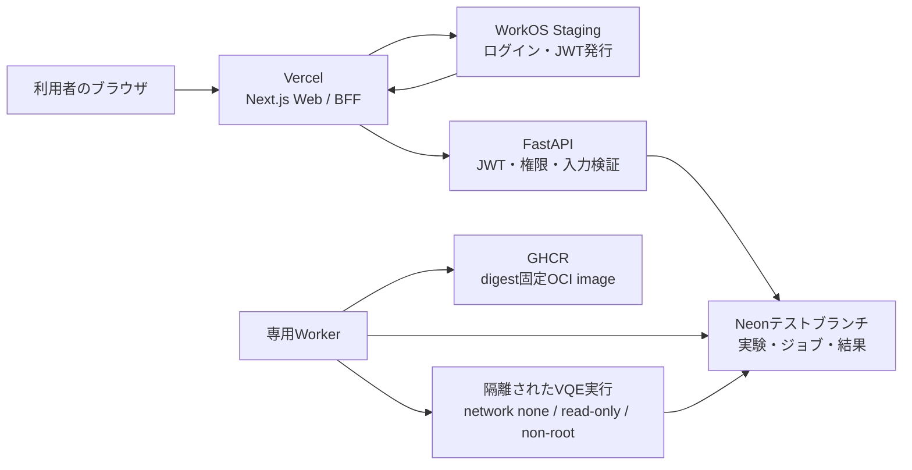

# VQEテスト環境の役割とWeb設定マニュアル

最終更新: 2026-07-27 JST  
対象: Majorana / Atlas VQE `feature/vqe`  
用途: **テスト専用**。本番公開・不特定多数へのVQE実行提供を許可する文書ではない。

## 1. まず一言で説明

このシステムは、一台のサービスですべてを行うのではなく、役割の異なる
サービスを安全につないで動かす。

| サービス | 初心者向けの例え | 実際の役割 | やらないこと |
|---|---|---|---|
| GitHub | 設計図の保管庫 | ソースコード、変更履歴、レビュー、CI | Web画面やVQEを常時提供しない |
| Vercel | 店舗の受付・画面 | Next.jsのWeb画面をHTTPSで配信する | Docker/OCI内のVQE計算を実行しない |
| WorkOS | 受付の本人確認係 | ログイン画面、ユーザー認証、署名付きトークン発行 | VQE結果や論文データを保存しない |
| FastAPI | 社内の窓口・規則係 | 権限確認、API、実験登録、ジョブ受付 | 重い量子計算をWebリクエスト内で実行しない |
| Neon | 帳簿・データベース | ユーザー、実験仕様、ジョブ、結果メタデータを保存 | ログイン画面や計算コンテナを提供しない |
| Worker | 作業場の担当者 | 待ち行列からジョブを取り、隔離環境で計算する | 公開Web画面を提供しない |
| OCI image | 封印された実験装置の設計 | Qiskit/PennyLaneと依存関係を固定する | それだけでは起動しない |
| GHCR | 実験装置の倉庫 | digestで固定したOCI imageを保管する | 実験の正しさを自動的に保証しない |
| GitHub Actions | 自動検査工場 | テスト、ビルド、短時間のE2E検証 | 常設の実行ホストにはしない |

重要なのは、**VercelはVQE計算機ではない**という点である。今回Vercelへ
置くのはWeb画面とBFFだけであり、実際のVQEは専用Workerがdigest固定済み
OCI imageを使って実行する。

## 2. 全体の流れ



ログインから計算までの順序は次のとおり。

1. 利用者がVercel上のWeb画面を開く。
2. WebがWorkOSのログイン画面へ利用者を送る。
3. WorkOSが本人確認し、改ざん検出可能なアクセストークンを発行する。
4. WebのBFFがトークンをFastAPIへ渡す。
5. FastAPIが発行元、署名、`client_id`、メール情報を検証する。
6. FastAPIがNeonへ実験仕様とジョブを記録する。
7. Workerがジョブを取得し、GHCRのdigest固定imageを隔離して実行する。
8. 結果とprovenanceをNeonへ戻し、WebがAPI経由で表示する。

## 3. 絶対に混ぜてはいけない情報

### ブラウザから見えてよい値

- `NEXT_PUBLIC_API_URL`
- `NEXT_PUBLIC_WORKOS_REDIRECT_URI`
- WorkOS Client ID
- Vercelの公開URL

`NEXT_PUBLIC_`で始まる変数は、ブラウザへ渡る可能性がある。**秘密値を
この名前で登録してはいけない。**

### 秘密として扱う値

- `WORKOS_API_KEY`
- `WORKOS_COOKIE_PASSWORD`
- Neonの`DATABASE_URL`
- GitHub/GHCRの書き込みtoken
- Workerや実行ホストの認証情報

秘密値はGit、Issue、PR、チャット、スクリーンショット、研究データへ
記録しない。パスワード管理ツールか、各サービスのSecrets機能へ保存する。

### 配置の原則

| 値 | Vercel Web | FastAPI host | Worker host |
|---|---:|---:|---:|
| `WORKOS_CLIENT_ID` | 必要 | 必要 | 不要 |
| `WORKOS_API_KEY` | 必要 | 不要 | 不要 |
| `WORKOS_COOKIE_PASSWORD` | 必要 | 不要 | 不要 |
| `NEXT_PUBLIC_WORKOS_REDIRECT_URI` | 必要 | 不要 | 不要 |
| `NEXT_PUBLIC_API_URL` | 必要 | 不要 | 不要 |
| `WORKOS_JWT_ISSUER` / `WORKOS_JWKS_URL` | 不要 | 必要な場合あり | 不要 |
| `WEB_ORIGIN` | 不要 | 必要 | 不要 |
| `DATABASE_URL` | **禁止** | 必要 | 必要 |
| OCI image digest | 不要 | 仕様・ジョブに必要 | 実行に必要 |

VercelのBFFはFastAPIへ接続する。Neonへ直接接続させない。

## 4. 今回のテスト構成

以下を別々のテスト資源として用意する。

- Vercel: テスト専用ProjectとPreview Deployment
- WorkOS: **Staging environment**
- Neon: 破棄可能なテストbranch
- FastAPI: HTTPSで到達できるテスト用control-plane host
- Worker: 外部公開しない専用host
- GHCR: digestで固定したQiskit/PennyLane image

WorkOSのStagingとProductionは、API key、Client ID、ユーザー、Redirect URI
などが分離される。今回Productionへ値をコピーしない。

## 5. 作業前チェック

次を満たさない場合はWeb設定を開始しない。

- [ ] GitHubの対象branchが`feature/vqe`である。
- [ ] Git working treeに意図しない変更がない。
- [ ] Vercel Project名に`test`または`staging`を含める。
- [ ] WorkOS画面のenvironment表示が`Staging`である。
- [ ] Neonはmain/productionではなく、削除可能なbranchを使う。
- [ ] FastAPIのテストURLが決まっている、またはWebの静的表示だけ先に試す。
- [ ] 秘密値を保存するパスワード管理場所が決まっている。
- [ ] テスト終了日と削除担当者を決める。

## 6. Web画面で行う作業

### Step 1: WorkOSでStagingを準備する

1. [WorkOS Dashboard](https://dashboard.workos.com/)へログインする。
2. Majorana用Projectを開く。
3. 画面上部のenvironmentが**Staging**であることを確認する。
4. `API Keys`または`Overview`で次を確認する。
   - Client ID: `client_...`
   - Staging API key: `sk_test_...`
5. API keyはパスワード管理ツールへ保存し、文書へ貼らない。
6. `Authentication` → `Features` → `JWT Template`を開く。
7. 少なくともメールclaimを追加する。

```json
{
  "email": "{{ user.email }}"
}
```

8. WorkOSのpreview機能で、出力が有効なJSONであり、`email`が文字列に
   なることを確認して保存する。

このAPIは初回ログイン時にユーザーとworkspaceを作るため、`email`がない
トークンを403で拒否する。JWT Templateはアクセストークンへ必要なclaimを
追加する機能であり、認証そのものを弱める設定ではない。

この時点ではRedirect URIをまだ登録できなくてもよい。Vercelの固定URLを
取得した後、Step 4で戻って設定する。

### Step 2: Neonで破棄可能なテストbranchを作る

1. [Neon Console](https://console.neon.tech/)へログインする。
2. MajoranaのProjectを開く。
3. `Branches` → `New branch`を選ぶ。
4. 名前を例として`test-vqe-vercel-20260727`にする。
5. 本番データを複製する必要がなければ、空または安全な開発branchを親にする。
6. `Connect`から次の二種類を区別して取得する。
   - **Direct connection**: migration専用
   - **Pooled connection**: FastAPIとWorkerの通常接続用
7. migrationは運用端末または承認済みCIからDirect connectionで実行する。
8. FastAPIとWorkerにはPooled connectionをSecretsとして登録する。
9. Vercelにはどちらの接続文字列も登録しない。
10. branch名、作成日、削除予定日だけを作業記録へ残す。

接続文字列はパスワードを含む。接続確認のスクリーンショットにも表示させない。

### Step 3: FastAPIのテストURLを準備する

#### 3-1. 「FastAPIのテストURL」とは何か

FastAPIは、VercelとNeonの間に置くサーバー側の窓口である。

```text
Vercel Web
    ↓ HTTPS
https://majorana-api-vqe-test-xxxxx.run.app
    ↓ pooled database connection
Neon test branch
```

上の`https://...run.app`がFastAPIのテストURLである。Pythonファイルに
URLを書けば作られるものではなく、FastAPI containerをCloud Runなどの
hostへdeployしたときにhostから発行される。

Vercelだけでは、次の処理を完結できない。

- WorkOS tokenの署名、issuer、`client_id`、email claimの検証
- ユーザーとworkspaceの権限確認
- Neonへの実験・ジョブ登録
- VQE Workerへ渡すジョブの作成
- 結果とprovenanceの取得

このrepositoryの正式な配置方針は、WebがVercel、APIがCloud Runである。
テストでも、**既存の`majorana-api`を流用せず**
`majorana-api-vqe-test`のような独立serviceを推奨する。既存serviceのrevisionを
使うと、既存のNeon databaseやsecretを継承する危険がある。

#### 3-2. 用意するもの

Cloud Runを作る前に、次の5点を用意する。

1. `feature/vqe`の確認済みcommit SHA
2. そのcommitからbuildしたFastAPI container image
3. Step 2で作ったNeonテストbranch
4. WorkOS StagingのClient ID、issuer、JWKS URL
5. Vercelで使う固定Preview URL

Vercel URLがまだない場合、最初は仮の`WEB_ORIGIN`でAPIをdark deployし、
Vercel URL取得後に更新する。仮URLのまま認証E2Eを始めてはいけない。

#### 3-3. Neon schemaを先に準備する

Cloud Run起動前に、テストbranchへ現在のschema migrationを適用する。

1. Neon Consoleの`Connect`で**Direct connection**を取得する。
2. 信頼できるローカル端末か承認済みCIでだけ、次を実行する。

```bash
read -rs "DATABASE_URL_DIRECT?Neon direct URL: " && export DATABASE_URL_DIRECT
uv run --package majorana-api alembic -c db/alembic.ini current
uv run --package majorana-api alembic -c db/alembic.ini upgrade head
uv run --package majorana-api alembic -c db/alembic.ini current
unset DATABASE_URL_DIRECT
```

3. 実行前と実行後のAlembic revisionだけを記録する。
4. connection stringそのものはterminal履歴、ログ、作業記録へ残さない。

Direct connectionはmigration専用である。Cloud Run APIにはNeonの
**Pooled connection**を渡す。

#### 3-4. container imageを確認する

Cloud Runには、FastAPIのソースではなくcontainer imageを指定する。
このrepositoryでは
[`services/api/Dockerfile`](../../services/api/Dockerfile)がAPI imageの定義で、
port `8080`からFastAPIを起動する。

次を満たすimageだけを使用する。

- [ ] `feature/vqe`の使用commit SHAが分かる。
- [ ] CI、テスト、image buildが成功している。
- [ ] image tagだけでなくdigestを記録できる。
- [ ] repository rootをbuild contextにしている。
- [ ] 個人PCの未commitファイルをimageへ混入させていない。

該当imageがArtifact Registryにない場合、ここで停止する。Cloud Run画面の
「ソースからdeploy」で場当たり的に別buildを作らず、承認済みCloud Buildか
CIで、正確なcommitからimageを作る。

#### 3-5. Secret ManagerへNeon接続を保存する

Google Cloud Consoleで次を行う。

1. 対象Projectがテスト用、または`majorana-core`内のテスト資源であることを確認する。
2. `Security` → `Secret Manager` → `Create secret`を開く。
3. 名前を例として`VQE_TEST_DATABASE_URL_POOLED`にする。
4. 値へStep 2で取得したNeonの**Pooled connection**を入れる。
5. Secretを作成し、Cloud Run runtime service accountに、このSecretだけを
   読める権限を付ける。
6. Project全体のSecret閲覧権限は付けない。
7. Cloud Runから参照するときは`latest`ではなく、作成したversion番号
   （例: `1`）へ固定する。接続をrotateするときは新versionを作り、新しい
   Cloud Run revisionで検証後に切り替える。

Direct connectionはCloud Runへ登録しない。migration用SecretとAPI用Secretを
同じ名前にしない。

#### 3-6. Cloud Runのテストserviceを作る

1. [Google Cloud Console](https://console.cloud.google.com/run)を開く。
2. 正しいGoogle Cloud Projectを選択する。
3. `Cloud Run` → `Create service`を選ぶ。
4. 設定を次のようにする。

| Cloud Runの項目 | テスト設定 |
|---|---|
| Service name | `majorana-api-vqe-test` |
| Region | 既存構成と同じ`us-west1` |
| Deployment type | Existing container image |
| Container image | 3-4で確認したAPI image |
| Authentication | Allow unauthenticated invocations |
| Ingress | All（Vercelから到達させるため） |
| Container port | `8080` |
| Minimum instances | `0` |
| Maximum instances | 小さい上限、例`2` |
| Startup command | 上書きしない |

`Allow unauthenticated invocations`は、すべての業務APIを無認証にする意味ではない。
VercelからCloud Runの入口へ到達可能にし、その後FastAPIがWorkOS JWTを検証する。
`/v1/me`などの保護endpointは、tokenなしなら401でなければならない。

ただし、`/health`と公開catalog endpointは設計上公開される。テストURLを
不必要に共有せず、ログを監視し、試験後にserviceを削除する。

#### 3-7. Cloud Runへ環境変数とSecretを設定する

`Containers` → `Variables & Secrets`で設定する。

##### 通常の環境変数

```text
MAJORANA_ENV=production
WORKOS_CLIENT_ID=client_...
WORKOS_JWT_ISSUER=<WorkOS Staging tokenの実際のiss>
WORKOS_JWKS_URL=<そのClient IDに対応するJWKS URL>
WEB_ORIGIN=https://<Vercelの固定Preview URL>
```

`WORKOS_JWT_ISSUER`と`WORKOS_JWKS_URL`を推測しない。WorkOSのJWT Template
previewに表示される実際の`iss`と、同じApplicationのClient IDに対応するJWKSを
確認する。2026-07-27のStaging検証では次の形だった。

```text
WORKOS_JWT_ISSUER=https://api.workos.com/user_management/<WORKOS_CLIENT_ID>
WORKOS_JWKS_URL=https://api.workos.com/sso/jwks/<WORKOS_CLIENT_ID>
```

`https://api.workos.com`だけをissuerとして設定すると、署名が正しくても
exact issuer検証で401になる。previewの`iss`をそのまま使用する。

`WEB_ORIGIN`はpathを含めず、Vercelのoriginだけを指定する。

```text
正: https://majorana-vqe-test.example.vercel.app
誤: https://majorana-vqe-test.example.vercel.app/auth/callback
誤: https://majorana-vqe-test.example.vercel.app/
```

ここで`MAJORANA_ENV=production`は「顧客向け本番」を意味する名前ではない。
コードのfail-closed保護を有効にし、ローカル開発用認証バイパスを禁止する
実行モードである。deploy先自体はテスト用である。

次は設定しない。

```text
MAJORANA_LOCAL_DEV_AUTH
MAJORANA_VQE_CANDIDATE_EXECUTION
DATABASE_URL_DIRECT
WORKOS_API_KEY
WORKOS_COOKIE_PASSWORD
```

WorkOS API keyとcookie passwordはVercel Web側の値であり、FastAPIには不要である。

##### Secret

Cloud Runの`DATABASE_URL`を、3-5で作った
`VQE_TEST_DATABASE_URL_POOLED`の確認済みversion番号へ紐付ける。

VQE Registryの公開APIも同じテストDBから表示する場合は、テストbranch内で
作成した3つの異なるUUIDを使い、次をまとめて設定する。

```text
SYSTEM_CATALOG_ENABLED=true
SYSTEM_CATALOG_WORKSPACE_ID=<test branchのUUID>
SYSTEM_CATALOG_IMPORTER_USER_ID=<別のUUID>
SYSTEM_CATALOG_PUBLIC_READER_USER_ID=<さらに別のUUID>
```

本番databaseのUUIDをテストserviceへコピーしてはいけない。3つのうち一部だけを
設定するとAPIはfail-closedで起動しない。

#### 3-8. 最初はVQE実行を無効にする

最初のdeployでは次を設定しない。

```text
MAJORANA_VQE_PRODUCTION_EXECUTION
```

この状態でも、ログイン、ユーザーprovisioning、Registry参照、実験仕様作成の
確認はできる。VQE実行まで試す場合だけ、専用Worker、digest固定image、
rollback手順を別に確認してから
`MAJORANA_VQE_PRODUCTION_EXECUTION=true`を設定する。

このflagをAPIに付けてもCloud Run API自身がVQEを計算するわけではない。
ジョブを処理する専用Workerが存在しなければ、ジョブは完了しない。

#### 3-9. Deploy後にURLと最低限の安全性を確認する

Deploy完了後、Cloud Runのservice詳細に表示されたURLを記録する。

```text
https://majorana-api-vqe-test-xxxxx.us-west1.run.app
```

秘密を含まない端末から次を確認する。

```bash
API_URL="https://<Cloud Run test URL>"

curl -i "$API_URL/health"
curl -i "$API_URL/v1/me"
curl -i "$API_URL/v1/catalog/entries?view=list"
```

期待値は次のとおり。

| 確認 | 期待結果 | 意味 |
|---|---|---|
| `/health` | `200`と`{"ok":true}` | containerが起動した |
| tokenなし`/v1/me` | `401` | 認証が閉じている |
| catalog | 有効時はJSON、無効時はfail-closed | catalog設定どおり |

`/health=200`だけでは、Neon、WorkOS、権限、VQEの成功を証明しない。
反対に、tokenなし`/v1/me=200`は重大異常である。直ちにserviceを削除または
trafficを止め、認証設定と使用imageを監査する。

#### 3-10. VercelとFastAPIを接続する

Cloud Run URLが安全に確認できたら、VercelのPreview環境へ次を設定する。

```text
NEXT_PUBLIC_API_URL=https://<Cloud Run test URL>
```

同時にCloud Runの`WEB_ORIGIN`がVercelの固定Preview originと完全一致することを
再確認する。

```text
Vercel NEXT_PUBLIC_API_URL ──指す──> Cloud Run API
Cloud Run WEB_ORIGIN       ──許可──> Vercel Web
```

この二つは逆向きの設定である。取り違えると、localhost接続、CORS失敗、
または意図しないorigin許可が起きる。

#### 3-11. WorkOS認証を含む接続確認

VercelをRedeployし、ブラウザからログインして次を確認する。

1. WorkOS Stagingのログインが完了する。
2. Vercel `/api/me`がFastAPI `/v1/me`へ到達する。
3. FastAPIが200を返し、実ユーザーのemail、workspace ID、roleが表示される。
4. Cloud Run logにJWT本文、Authorization header、DB URLが出ていない。
5. Neonのテストbranchだけにユーザー/workspace行が作られる。

失敗の切り分けは次の順で行う。

```text
/health失敗
  → image、port、起動設定、DATABASE_URLを確認

/health成功、/v1/meが401
  → WorkOS issuer、JWKS、client_id、Vercel token転送を確認

/v1/meが403
  → JWT Templateのemail claimを確認

ブラウザだけ失敗
  → WEB_ORIGINとVercel URL、NEXT_PUBLIC_API_URLを確認

500
  → Cloud Run logとNeon migration revisionを確認
```

401、403、CORSを回避する目的でJWT検証やCORSを無効化してはいけない。

#### 3-12. FastAPIだけを直ちに停止する方法

異常時は、Vercelより先にVQE受付を閉じる。

1. `MAJORANA_VQE_PRODUCTION_EXECUTION`を削除または`false`にする。
2. 専用Workerを停止する。
3. Cloud Runのtest serviceを削除するか、ingress/trafficを閉じる。
4. `VQE_TEST_DATABASE_URL_POOLED`へのCloud Runアクセス権を外す。
5. WorkOS StagingのRedirect URIとAPI keyは、全体試験終了時に削除・失効する。
6. 最後にNeon test branchを削除する。

既存の`majorana-api`、本番Neon branch、Production WorkOS environmentには
触れない。

### Step 4: VercelでテストProjectを作る

1. [Vercel Dashboard](https://vercel.com/dashboard)へログインする。
2. `Add New...` → `Project`を選ぶ。
3. GitHubから`EshMis/majorana`をImportする。
4. Project名を例として`majorana-vqe-test`にする。
5. 対象branchは`feature/vqe`をPreviewとして使う。
6. Frameworkは`Next.js`を選ぶ。
7. Root Directoryを`apps/web`に設定し、秘密値を入れる前に次のCheckpointを
   確認する。

#### Vercel build Checkpoint

現在のrepositoryはpnpm workspaceで、Next.js applicationは
`apps/web/package.json`にある。Vercel Projectの設定は次にする。

```text
Root Directory:  apps/web
Framework:       Next.js
Install Command: pnpm install --frozen-lockfile
Build Command:   pnpm build
Output Directory: .next
```

Root Directoryがrepository root（空欄または`.`）だと、root packageには
Next.js dependencyがないため、Vercelは`No Next.js version detected`で停止する。
`apps/web`へ変更してから秘密値なしでbuildする。Vercelが`.next`を見つけられない
場合は、他の設定を同時に変えず、build logを保存して原因を切り分ける。

8. 最初のDeploymentが成功したら、`Domains`またはDeployment詳細から
   `feature/vqe`で安定して使えるHTTPS URLを選ぶ。
9. `Settings` → `Environment Variables`を開く。
10. 対象を**Preview**、可能ならbranchを`feature/vqe`へ限定して登録する。

| 変数 | 値 | 秘密か |
|---|---|---:|
| `WORKOS_CLIENT_ID` | WorkOS StagingのClient ID | 低 |
| `WORKOS_API_KEY` | WorkOS Staging API key | **高** |
| `WORKOS_COOKIE_PASSWORD` | この環境専用の十分長いランダム値 | **高** |
| `NEXT_PUBLIC_WORKOS_REDIRECT_URI` | `https://<固定URL>/auth/callback` | 公開 |
| `NEXT_PUBLIC_API_URL` | FastAPIテストhostのHTTPS URL | 公開 |

`WORKOS_COOKIE_PASSWORD`はローカル端末で次のように生成できる。

```bash
openssl rand -base64 32
```

11. `DATABASE_URL`をVercelへ追加していないことを確認する。
12. `WORKOS_API_KEY`やcookie passwordの変数名に`NEXT_PUBLIC_`がないことを
    確認する。
13. Environment Variables追加後にRedeployする。既存Deploymentへ新しい値は
    自動反映されない。

### Step 5: WorkOSへVercelのRedirect URIを登録する

1. WorkOS Dashboardへ戻る。
2. environmentが**Staging**であることを再確認する。
3. `Applications`または`Redirect URIs`を開く。
4. 次を完全一致で追加する。

```text
https://<Vercelの固定Preview URL>/auth/callback
```

5. `http`/`https`、末尾slash、Preview URLのbranchが一致することを確認する。
6. 保存後、Vercelをもう一度Redeployする必要はない。ただしVercel側の
   redirect環境変数を変更した場合はRedeployする。

### Step 6: ブラウザでE2E確認する

順番を飛ばさず、各結果を時刻・commit SHA・Deployment URLとともに記録する。
トークンやcookieそのものは記録しない。

- [ ] `/repository`の公開範囲がログインなしで表示される。
- [ ] 保護ページが勝手に表示されず、WorkOSへredirectされる。
- [ ] Stagingユーザーでログインできる。
- [ ] `/auth/callback`が成功し、無限redirectにならない。
- [ ] `/run`にログイン済みWorkspaceが表示される。
- [ ] Webの`/api/me`経由でFastAPIの`/v1/me`が成功する。
- [ ] 実ユーザーID、workspace ID、roleが返る。
- [ ] VQE Registryのlist/detailが同じ根拠データを示す。
- [ ] 実験作成時にScientificExperimentSpecとprovenanceが保存される。
- [ ] 実行gateを無効にした状態では、VQE実行要求がfail-closedになる。
- [ ] 実行を明示的に有効化した試験では、Workerがdigest固定imageを使う。
- [ ] 別ユーザーを使う場合、他人のworkspaceデータが見えない。
- [ ] Browser DevToolsの通信、HTML、JavaScript bundleに秘密値がない。

最後の項目でVQE実行を行うとき、Vercelはジョブを受け付ける入口にすぎない。
計算は専用Workerで行われなければならない。

## 7. 合格条件

以下がすべて揃ったときだけ「テストE2E成功」と表現する。

1. 使用commit SHAとVercel Deployment URLが記録されている。
2. WorkOS Stagingのログイン、JWT署名、issuer、`client_id`、email claimが検証された。
3. FastAPIがNeonテストbranchへ接続した。
4. migration revisionが期待値と一致した。
5. 2ユーザーを使う場合、workspace分離が確認された。
6. 実行試験ではOCI digest、backend、seed、入力spec、結果artifactが記録された。
7. 秘密値がlog、artifact、browserへ漏れていない。
8. rollbackを実行できる担当者と手順が決まっている。

Web画面が表示されただけなら「Vercel build成功」であり、認証E2E成功ではない。
ログインできただけなら「認証成功」であり、VQE科学実証成功ではない。

## 8. 異常時の見方

| 症状 | よくある原因 | 最初に確認する場所 |
|---|---|---|
| Vercel buildが失敗 | monorepoのRoot/出力先不一致 | Vercel Build Logsと`vercel.json` |
| ログイン後に元へ戻らない | Redirect URI不一致 | WorkOS StagingとVercel環境変数 |
| redirectが繰り返される | callback、cookie password、URL不一致 | Vercel Function Logs |
| `/api/me`が500 | `NEXT_PUBLIC_API_URL`未設定でlocalhostへ接続 | Vercel環境変数 |
| FastAPIが401 | issuer、JWKS、署名、`client_id`不一致 | FastAPI auth log |
| FastAPIが403 | JWTに`email`がない | WorkOS JWT Template |
| BrowserだけCORSエラー | `WEB_ORIGIN`がVercel URLと不一致 | FastAPI環境変数 |
| DB接続が頻繁に切れる | 通常処理にDirect connectionを使用 | FastAPI/WorkerのSecret |
| VQE実行が拒否される | 実行gateが無効 | 仕様どおりなら正常 |
| imageを取得できない | digest、GHCR権限、事前pull不備 | Workerのpreflight log |
| 結果は出たが比較不能 | seed、backend、spec、digest不足 | provenance record |

401や403を回避するために検証を無効化してはいけない。原因を修正する。

## 9. テスト終了時の停止・削除

異常時は上から順に止める。

1. FastAPIの`MAJORANA_VQE_PRODUCTION_EXECUTION`を削除または`false`にする。
2. Workerを停止する。
3. Vercel Preview Deploymentを停止・保護・削除する。
4. WorkOS Stagingから使用済みRedirect URIを削除する。
5. WorkOS Staging API keyを失効させる。
6. Neonのテストbranchを削除する。
7. Vercelの`WORKOS_COOKIE_PASSWORD`を削除する。
8. 漏えいの疑いがあれば、該当するすべてのsecretをrotateする。
9. 削除した資源、時刻、担当者、残存資源を記録する。

Neon branch削除前に、研究上必要な結果を秘密を含まないartifactとして保存する。
ただし、テストデータを「論文性能の再現結果」として昇格させてはいけない。

## 10. 作業記録テンプレート

秘密値は記入しない。

```text
作業日:
担当者:
Git commit SHA:
Vercel Project:
Vercel Preview URL:
Vercel Deployment ID:
WorkOS Project:
WorkOS environment: Staging
WorkOS Client ID末尾4文字:
FastAPI test URL:
Neon Project:
Neon branch:
Alembic revision:
OCI Qiskit digest:
OCI PennyLane digest:
実行gate: disabled / enabled
確認した項目:
失敗と対応:
削除予定日:
削除担当者:
```

## 11. 公式資料

- [Vercel: Git連携とPreview Deployment](https://vercel.com/docs/git)
- [Vercel: MonorepoとRoot Directory](https://vercel.com/docs/monorepos)
- [Vercel: Environment Variables](https://vercel.com/docs/environment-variables)
- [Vercel: Environments](https://vercel.com/docs/deployments/environments)
- [Google Cloud: Cloud Runへcontainer imageをdeployする](https://cloud.google.com/run/docs/deploying)
- [Google Cloud: Cloud RunのEnvironment Variables](https://cloud.google.com/run/docs/configuring/services/environment-variables)
- [Google Cloud: Cloud RunとSecret Manager](https://cloud.google.com/run/docs/configuring/services/secrets)
- [Google Cloud: Cloud Runの公開アクセス](https://cloud.google.com/run/docs/authenticating/public)
- [WorkOS: StagingとProductionの分離](https://workos.com/docs/authkit/environments)
- [WorkOS: Applications](https://workos.com/docs/authkit/applications)
- [WorkOS: JWT Templates](https://workos.com/docs/authkit/jwt-templates)
- [WorkOS: Redirect URIを使う認証フロー](https://workos.com/docs/reference/authkit/authentication/get-authorization-url)
- [Neon: Connection Pooling](https://neon.com/docs/connect/connection-pooling)

Dashboardの表示名はサービス更新で変わる可能性がある。名称が異なる場合も、
Staging/Preview/branch分離、秘密値の配置、rollbackという不変条件を優先する。
