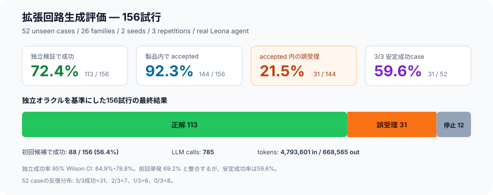
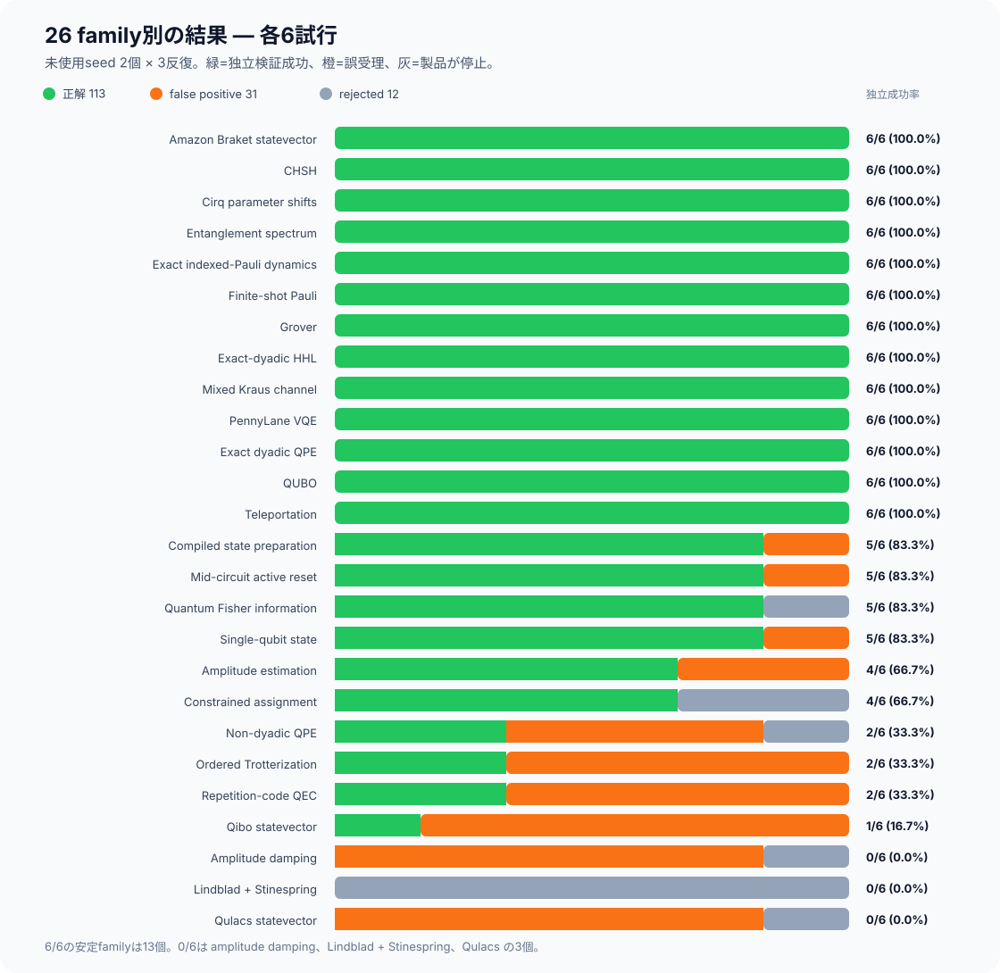
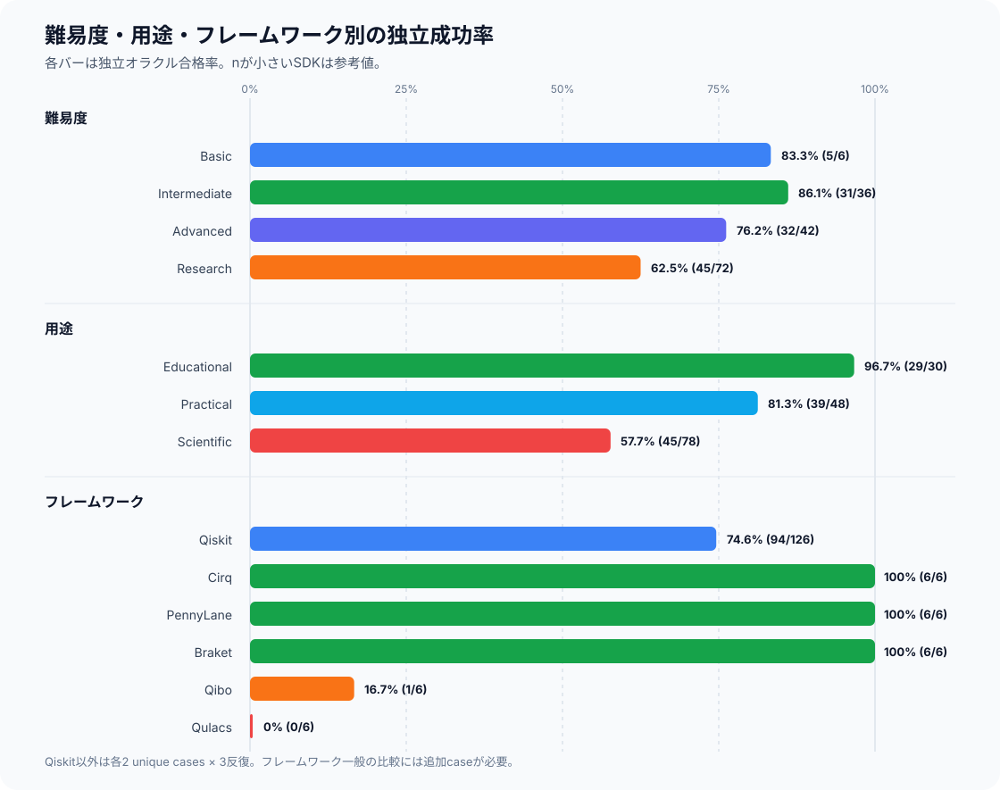

# Procedural v3 expanded circuit-generation evaluation — 2026-08-07

## 結論

実際のLeona Quantum agentで、**52個の未使用問題 × 3反復 = 156試行**を
完走した。独立オラクル基準の成功率は **72.4%（113/156）**、95% Wilson
信頼区間は **64.9%–78.8%** だった。

製品内部では144件をacceptedしたが、そのうち31件は独立検証で不正解だった。
したがって、accepted率92.3%を成功率として扱うことはできない。acceptedされた
成果物の **21.5%（31/144）がfalse positive** だった。

| 指標 | 結果 | 解釈 |
|---|---:|---|
| 独立検証成功 | **113 / 156 (72.4%)** | 主要な成功率 |
| 95% Wilson CI | 64.9%–78.8% | 前回26件のみの50.0%–83.5%より狭い |
| 製品内accepted | 144 / 156 (92.3%) | 正しさを20ポイント近く過大評価 |
| accepted内false positive | **31 / 144 (21.5%)** | 受理成果物の約5件に1件が不正解 |
| 製品が停止した失敗 | 12 / 156 (7.7%) | 誤成果物を受理しなかった失敗 |
| 初回候補で独立成功 | 88 / 156 (56.4%) | 修正なしで正解した割合 |
| 3/3安定成功case | **31 / 52 (59.6%)** | 同じ問題を3回とも解けた割合 |
| 平均候補数 | 1.78 | 278 candidates / 156 trials |
| 記録済みLLM calls | 785 | 平均5.03 calls / trial |
| 記録済みtokens | 4,793,601 in / 668,565 out | provider請求値ではなくdurable event合計 |

前回の単発26件は18/26（69.2%）だった。今回の72.4%はその範囲と整合し、
単発結果が大きく外れてはいなかった。一方、反復を要求すると安定成功率は
59.6%まで下がるため、実運用の目安にはこちらが重要である。

前回分も単純合算すると、実行済み総数は **182試行、131成功（72.0%）**、
false positiveは37件、accepted内誤受理率は37/168（22.0%）となる。ただし
前回seedだけ反復数が1なので、主要推定値には今回の均衡した156試行を使う。

## 実験設定

- Generator: `procedural-v3`
- Unseen seeds: `2026080702`, `2026080703`
- Coverage: 各seedで26 familyから1 instance、合計52 unique cases
- Repetitions: 各case 3回
- Prompt variant: `base`
- Provider profile: `openai`。現在の生成・修正roleはDeepSeek V4 Pro、
  independent audit roleはDeepSeek V4 Flash
- Execution: 実Leona Quantum pipeline + `LocalSubprocessSandbox`
- Scoring: fingerprint-bound execution evidenceを独立した解析・列挙オラクルと比較

## Family別結果

各familyは2つの異なる問題instanceを3回ずつ、計6回評価した。「安定case」は
各seedのinstanceを3回すべて正解した数で、最大2である。

| Family | Framework | 正解 | False positive | Reject | 安定case | 平均候補 | LLM calls |
|---|---|---:|---:|---:|---:|---:|---:|
| Amazon Braket statevector | Braket | **6/6** | 0 | 0 | 2/2 | 2.33 | 28 |
| CHSH | Qiskit | **6/6** | 0 | 0 | 2/2 | 1.00 | 20 |
| Cirq parameter shifts | Cirq | **6/6** | 0 | 0 | 2/2 | 1.33 | 22 |
| Entanglement spectrum | Qiskit | **6/6** | 0 | 0 | 2/2 | 1.00 | 18 |
| Exact indexed-Pauli dynamics | Qiskit | **6/6** | 0 | 0 | 2/2 | 1.67 | 29 |
| Finite-shot Pauli | Qiskit | **6/6** | 0 | 0 | 2/2 | 1.00 | 20 |
| Grover | Qiskit | **6/6** | 0 | 0 | 2/2 | 1.00 | 18 |
| Exact-dyadic HHL | Qiskit | **6/6** | 0 | 0 | 2/2 | 1.17 | 31 |
| Mixed Kraus channel | Qiskit | **6/6** | 0 | 0 | 2/2 | 1.17 | 19 |
| PennyLane VQE | PennyLane | **6/6** | 0 | 0 | 2/2 | 1.00 | 25 |
| Exact dyadic QPE | Qiskit | **6/6** | 0 | 0 | 2/2 | 1.00 | 18 |
| QUBO | Qiskit | **6/6** | 0 | 0 | 2/2 | 1.00 | 24 |
| Teleportation | Qiskit | **6/6** | 0 | 0 | 2/2 | 2.17 | 35 |
| Compiled state preparation | Qiskit | 5/6 | 1 | 0 | 1/2 | 1.83 | 29 |
| Mid-circuit active reset | Qiskit | 5/6 | 1 | 0 | 1/2 | 1.67 | 29 |
| Quantum Fisher information | Qiskit | 5/6 | 0 | 1 | 1/2 | 2.00 | 26 |
| Single-qubit state | Qiskit | 5/6 | 1 | 0 | 1/2 | 1.00 | 19 |
| Amplitude estimation | Qiskit | 4/6 | 2 | 0 | 0/2 | 1.17 | 20 |
| Constrained assignment | Qiskit | 4/6 | 0 | 2 | 1/2 | 2.50 | 39 |
| Non-dyadic QPE | Qiskit | 2/6 | 3 | 1 | 0/2 | 2.17 | 42 |
| Ordered Trotterization | Qiskit | 2/6 | 4 | 0 | 0/2 | 2.67 | 53 |
| Repetition-code QEC | Qiskit | 2/6 | 4 | 0 | 0/2 | **6.00** | **87** |
| Qibo statevector | Qibo | 1/6 | 5 | 0 | 0/2 | 1.00 | 18 |
| Amplitude damping | Qiskit | **0/6** | 5 | 1 | 0/2 | 3.17 | 36 |
| Lindblad + Stinespring | Qiskit | **0/6** | 0 | 6 | 0/2 | 0.00 | 29 |
| Qulacs statevector | Qulacs | **0/6** | 5 | 1 | 0/2 | 4.33 | 51 |

### 能力の分類

- **安定（6/6）:** 13/26 family。CHSH、Grover、QPE、HHL、VQE、
  teleportation、Kraus channelなど。
- **概ね成功（4–5/6）:** 6/26 family。状態準備、active reset、QFI、
  amplitude estimation、assignmentなど。
- **不安定（1–2/6）:** 4/26 family。non-dyadic QPE、Trotter、QEC、Qibo。
- **未成功（0/6）:** 3/26 family。amplitude damping、Lindblad、Qulacs。

## 難易度・用途・フレームワーク

| Slice | 正解 | 成功率 | False positive | 平均候補 |
|---|---:|---:|---:|---:|
| Basic | 5/6 | 83.3% | 1 | 1.00 |
| Intermediate | 31/36 | 86.1% | 5 | 1.47 |
| Advanced | 32/42 | 76.2% | 7 | 1.93 |
| Research | 45/72 | **62.5%** | 18 | 1.92 |
| Educational | 29/30 | **96.7%** | 1 | 1.30 |
| Practical | 39/48 | 81.3% | 7 | 1.56 |
| Scientific | 45/78 | **57.7%** | 23 | 2.10 |

BasicがIntermediateより低いのは、single-qubit Bloch Y符号を1回誤受理した
ためであり、難易度の逆転を一般化できる規模ではない。より強い傾向は、
Educational 96.7%に対してScientificが57.7%である点である。

| Framework | Trials | 正解 | 成功率 | False positive | Reject |
|---|---:|---:|---:|---:|---:|
| Qiskit | 126 | 94 | 74.6% | 21 | 11 |
| Cirq | 6 | 6 | 100% | 0 | 0 |
| PennyLane | 6 | 6 | 100% | 0 | 0 |
| Braket | 6 | 6 | 100% | 0 | 0 |
| Qibo | 6 | 1 | 16.7% | 5 | 0 |
| Qulacs | 6 | 0 | 0% | 5 | 1 |

非Qiskitはそれぞれ2 unique casesの反復にすぎないため、SDK全体の優劣とは
まだ断定できない。ただしBraketは初回候補0/6から修正後6/6になっており、
修正ループが有効だった。Qiboは5/6、Qulacsはacceptedされた5/5が誤答で、
現在のstatevector出力検証には明確な問題がある。

## Seed・反復間のばらつき

| Seed | Trials | 正解 | 成功率 | Product accepted | False positive | 初回成功 |
|---|---:|---:|---:|---:|---:|---:|
| 2026080702 | 78 | 56 | 71.8% | 72 | 16 | 40 |
| 2026080703 | 78 | 57 | 73.1% | 72 | 15 | 48 |

seed間の差は1件だけで、今回の全体率は特定seedに大きく依存していない。

| Trial | 正解 | 成功率 | Product accepted | False positive | 初回成功 |
|---:|---:|---:|---:|---:|---:|
| 1 | 37/52 | 71.2% | 46 | 9 | 30 |
| 2 | 40/52 | 76.9% | 49 | 9 | 27 |
| 3 | 36/52 | 69.2% | 49 | 13 | 31 |

52 unique casesの反復分布は、3/3成功31件、2/3成功7件、1/3成功6件、
0/3成功8件だった。試行単位の成功率だけでは、この確率的な不安定性を隠す。

## 主な失敗パターン

1. **Qubit/register orderと符号**
   - Qiboは5回、Qulacsは少なくとも複数回でBloch Y符号を反転。
   - QulacsではBloch Xも反転する試行があり、acceptedされた5件すべて不正解。
   - single-qubit Qiskitでも1回、同じBloch Y符号ミスが発生。
2. **チャネル表現**
   - Amplitude dampingは0/6。5件を誤受理し、1件だけ収束不能として停止。
   - 出力population・coherence・purityが独立オラクルと系統的に不一致。
   - Lindbladは6/6で計画・参照consensus段階から先へ進めなかった。
3. **位相・registerの読み方**
   - Amplitude estimationは2件、non-dyadic QPEは3件を誤受理。
   - dominant integer、phase estimate、確率分布を誤ったbit orderで解釈する傾向。
4. **QECと時間発展**
   - Repetition QECは2/6、4 false positives、平均6候補、合計87 calls。
   - Trotterizationは2/6、4 false positives、合計53 calls。
   - 誤った成果物に多くの修正コストを使った後も受理する点が重大。
5. **出力契約の欠落**
   - Compiled state preparationと一部QEC/Qulacsでは、要求されたRESULT keyが
     欠けているのにtrusted evidenceとしてmaterializeされた。
6. **正しく停止した12件**
   - `candidate_not_converging`: 5
   - `plan_output_invalid`: 4
   - `lindblad_reference_consensus_failed`: 2
   - `execution_timeout`: 1

失敗の中心は構文エラーではなく、**実行可能でそれらしいが、量子ビット順序・
符号・回路意味・出力契約が間違っているコードをレビューが受理すること**である。

## 優先改善順

1. 独立オラクルを保存前の必須gateにし、semantic reviewだけのacceptedを廃止。
2. Bloch vector、Qiskit register order、phase marginalizationを決定論的に検証。
3. `RESULT` promised keysの完全性をmaterialize前に強制。
4. QEC recoveryとPauli evolutionの専用verificationを追加。
5. Lindblad reference extraction/consensusを修正。
6. 高コストfamilyに候補予算と「改善していない候補」の早期停止を導入。
7. Qibo/Qulacs/Cirq/PennyLane/Braketは各10 unique cases以上へ拡張して、
   SDK差と問題family差を分離。

## Artifacts

- Raw report:
  `report-procedural-v3-expanded-seeds-2026080702-2026080703-deepseek-20260807.json`
- Raw report SHA-256:
  `96ae21736e7c58adef66ebe9854730557a02fdc7e86bc6da49a1b8458cec2824`
- Previous 26-trial baseline:
  `procedural-v3-full-evaluation-2026-08-07.md`

The token figures are durable `llm.call` event totals, not provider billing totals.
A request that failed before its response was persisted is not included.
