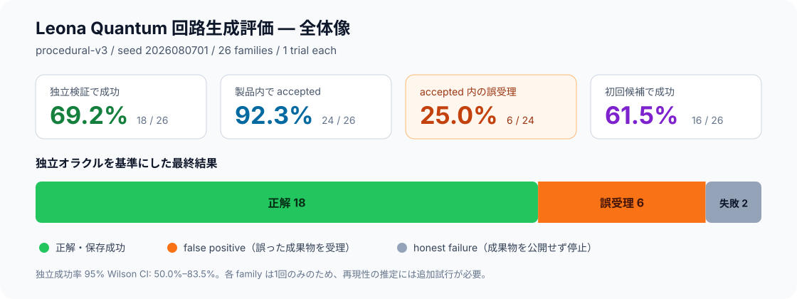
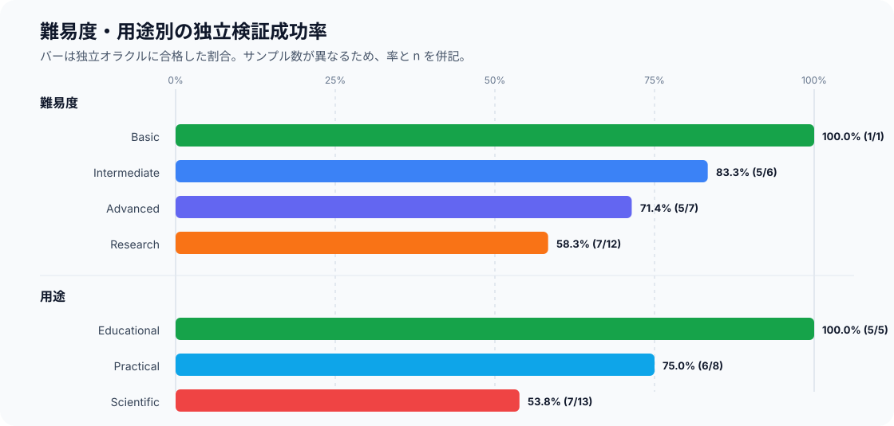

# Procedural v3 full-family circuit-generation evaluation — 2026-08-07

> This 26-trial report is the initial baseline. The balanced 156-trial follow-up is
> [procedural-v3-expanded-evaluation-2026-08-07.md](procedural-v3-expanded-evaluation-2026-08-07.md).

## ひと目で分かるサマリー

最も重要な数値は、Leona Quantum 内部の `accepted` 率 92.3% ではなく、独立
オラクルで正しさを確認できた **69.2%** です。accepted された24件のうち6件
（25.0%）は誤った結果を含む false positive でした。

| 観点 | 件数 | 率 | 読み方 |
|---|---:|---:|---|
| 独立検証で成功 | 18 / 26 | **69.2%** | 現時点で最も信頼できる全体成功率 |
| 製品内で accepted | 24 / 26 | 92.3% | 内部判定だけを見ると成功率を23.1ポイント過大評価 |
| accepted 内の false positive | 6 / 24 | **25.0%** | 受理した成果物の4件に1件が独立検証で不正解 |
| honest failure | 2 / 26 | 7.7% | 誤成果物を保存せず、生成・計画段階で停止 |
| 初回候補で成功 | 16 / 26 | 61.5% | 修正ループなしで独立検証まで通過 |

Educational は5/5で成功しましたが、Scientific は7/13（53.8%）でした。
Research 難易度も7/12（58.3%）まで低下しており、ノイズ・QEC・時間発展などの
科学計算系が現在の主要な弱点です。

## 全26問題の結果一覧

凡例: ✅ 独立検証まで成功、⚠️ 製品が誤って受理、❌ 製品が失敗を正しく検出。
「候補」は生成・修正されたコード候補数です。

| # | 問題 family | 難易度 / 用途 | 最終評価 | 製品判定 | 候補 | LLM calls |
|---:|---|---|---|---|---:|---:|
| 1 | Basic single-qubit state | basic / educational | ✅ 成功 | accepted | 1 | 3 |
| 2 | Finite-shot Pauli estimation | intermediate / practical | ✅ 成功 | accepted | 1 | 3 |
| 3 | Mid-circuit active reset | advanced / practical | ✅ 成功 | accepted | 1 | 3 |
| 4 | Native gate-basis compilation | advanced / practical | ✅ 成功 | accepted | 1 | 3 |
| 5 | Arbitrary-bipartition entanglement spectrum | research / scientific | ✅ 成功 | accepted | 1 | 3 |
| 6 | Explicit QUBO generalization | advanced / practical | ✅ 成功 | accepted | 1 | 4 |
| 7 | Constrained minimum-cost assignment | advanced / practical | ❌ honest failure | rejected | 4 | 9 |
| 8 | Exact dyadic phase estimation | research / scientific | ✅ 成功 | accepted | 2 | 5 |
| 9 | Non-dyadic finite-register QPE | research / scientific | ✅ 成功 | accepted | 1 | 4 |
| 10 | Finite-register amplitude estimation | research / scientific | ⚠️ false positive | accepted | 2 | 5 |
| 11 | Coherent-input amplitude damping | research / scientific | ⚠️ false positive | accepted | 1 | 3 |
| 12 | Mixed-state Kraus-channel execution | advanced / practical | ✅ 成功 | accepted | 1 | 3 |
| 13 | Lindblad evolution with Stinespring witness | research / scientific | ❌ honest failure | rejected | 0 | 5 |
| 14 | Entangled Cirq parameter shifts | intermediate / educational | ✅ 成功 | accepted | 1 | 3 |
| 15 | General Pauli-generator QFI | research / scientific | ✅ 成功 | accepted | 1 | 3 |
| 16 | Multi-solution Grover amplification | advanced / educational | ✅ 成功 | accepted | 1 | 3 |
| 17 | Partially entangled CHSH | intermediate / educational | ✅ 成功 | accepted | 1 | 3 |
| 18 | Coherent arbitrary-state teleportation | intermediate / educational | ✅ 成功 | accepted | 1 | 3 |
| 19 | Coherent repetition-code QEC | research / scientific | ⚠️ false positive | accepted | 2 | 4 |
| 20 | Ordered second-order Pauli Trotterization | research / scientific | ⚠️ false positive | accepted | 8 | 19 |
| 21 | Exact indexed-Pauli dynamics | research / scientific | ✅ 成功 | accepted | 1 | 4 |
| 22 | Exact-dyadic HHL linear system | research / scientific | ✅ 成功 | accepted | 1 | 5 |
| 23 | Complex PennyLane VQE | research / scientific | ✅ 成功 | accepted | 1 | 3 |
| 24 | Amazon Braket local statevector | intermediate / practical | ✅ 成功 | accepted | 3 | 6 |
| 25 | Qibo NumPy statevector | intermediate / practical | ⚠️ false positive | accepted | 1 | 3 |
| 26 | Qulacs native statevector | advanced / scientific | ⚠️ false positive | accepted | 1 | 3 |

### この表から見えること

- **安定している領域:** 状態準備、Pauli 推定、Grover、CHSH、teleportation、QFI。
- **危険な領域:** qubit/register order、Bloch Y の符号、QEC recovery、Pauli 時間発展。
- **最大のコスト外れ値:** Trotterization は8候補・19 callsを消費した後も誤受理。
- **SDK横断:** Braket は成功。Qibo/Qulacs は実行自体には成功したが、同じ Bloch Y
  符号ミスを独立検証で検出。

## Result

- **Independent-oracle pass:** 18 / 26 (**69.2%**)
- **95% Wilson interval:** 50.0%–83.5%
- **Product accepted:** 24 / 26 (92.3%)
- **False positives:** 6 / 26 (23.1% of all cases; 25.0% of accepted cases)
- **False negatives:** 0
- **First-candidate pass:** 16 / 26 (61.5%)
- **Candidate revisions:** 40 (mean 1.54 per case)
- **Recorded LLM calls:** 115
- **Recorded tokens:** 709,837 input / 94,457 output

The token figures are durable `llm.call` event totals, not provider billing totals. A
request that failed before its response was persisted is not included.

## Method

- Generator: `procedural-v3`
- Seed: `2026080701`
- Coverage: one unseen instance from each of 26 circuit families
- Prompt surfaces: one per instance
- Repetitions: one
- Provider profile: `openai`, whose current substantive-stage defaults resolve to
  DeepSeek V4 Pro and whose independent audit role resolves to DeepSeek V4 Flash
- Execution: the real fixed Leona Quantum pipeline with `LocalSubprocessSandbox`
- Scoring: protected `RESULT` and fingerprint-bound execution evidence against
  independently generated analytic/enumerative oracles

This is a first baseline, not a release estimate. One trial per family leaves material
model variance; the confidence interval above describes only the pooled 26-case Bernoulli
rate and does not establish each family's individual reliability.

## Slice results

| Slice | Passed | Rate | False positives | First-candidate pass |
|---|---:|---:|---:|---:|
| Basic | 1 / 1 | 100.0% | 0 | 1 |
| Intermediate | 5 / 6 | 83.3% | 1 | 4 |
| Advanced | 5 / 7 | 71.4% | 1 | 5 |
| Research | 7 / 12 | 58.3% | 4 | 6 |
| Educational | 5 / 5 | 100.0% | 0 | 5 |
| Practical | 6 / 8 | 75.0% | 1 | 5 |
| Scientific | 7 / 13 | 53.8% | 5 | 6 |

Difficulty and workload are intentionally not interchangeable: the educational slice
contains Grover, CHSH, teleportation, and a Cirq gradient task, while the scientific slice
contains reference-heavy noise, error-correction, dynamics, and variational tasks.

## Passed families

The following 18 cases passed both product terminal checks and the independent oracle:

- single-qubit state preparation
- finite-shot Pauli estimation
- mid-circuit active reset
- native gate-basis compilation
- arbitrary-bipartition entanglement spectrum
- explicit QUBO
- exact dyadic QPE
- non-dyadic finite-register QPE
- mixed-state Kraus-channel execution
- Cirq parameter-shift gradient
- general Pauli-generator QFI
- multi-solution Grover
- partially entangled CHSH
- coherent arbitrary-state teleportation
- exact indexed-Pauli dynamics
- exact-dyadic HHL linear system
- complex PennyLane VQE
- Amazon Braket local statevector

Braket passed after three candidate revisions. Exact QPE needed two. Every other passed
family used one candidate.

## Failed families and attribution

### Honest terminal failures

1. **Constrained assignment** — `candidate_not_converging` in `generate` after four
   candidates, three sandbox attempts, and nine recorded calls. No trusted result or
   artifact was produced.
2. **Lindblad + Stinespring witness** — `lindblad_reference_extraction_invalid` in
   `plan`; no candidate or sandbox attempt was reached.

These are honest failures: the product did not publish an incorrect artifact.

### False positives

1. **Finite-register amplitude estimation** — evaluation-register probabilities were
   marginalized with the wrong Qiskit bit positions. Observed amplitude 0.99039264 vs
   oracle 0.96193977; dominant-pair probability 0.45990986 vs 0.87745358.
2. **Coherent-input amplitude damping** — the generated custom unitary and initial-state
   vector used inconsistent Qiskit basis/qubit order. All population/coherence values
   were wrong while semantic review accepted them.
3. **Coherent repetition-code QEC** — generated phase-flip syndrome/recovery logic gave
   worst-case fidelity approximately 0 instead of 1.0.
4. **Ordered second-order Trotterization** — the final candidate omitted the requested
   initial-state preparation from `FINAL_CIRCUIT`, used an incorrect Pauli-evolution
   decomposition/rotation factor, and returned fidelity 0.21300618 vs oracle 0.99999821.
   It consumed all eight candidates and 19 calls but was still materialized.
5. **Qibo statevector** — computed Bloch Y as
   `2*Im(alpha*conj(beta))`; the correct convention is
   `2*Im(conj(alpha)*beta)`, so only the Y sign was reversed.
6. **Qulacs statevector** — the same Bloch-Y sign error as Qibo; the generated artifact
   also added a measurement to `FINAL_CIRCUIT` while evaluating a separate unmeasured
   copy.

The dominant failure class is therefore not syntax or SDK availability. It is a
**semantically plausible, executable program with wrong qubit order, sign, or circuit
identity that the product review accepts**.

## Infrastructure finding

The first full run aborted when the Braket case attempted to insert a `runs.framework`
value. Migration `0048` expands `run_candidates.framework` and agent tool names, but does
not expand the existing framework constraints on `runs`, `artifacts`, or
`artifact_versions`. The local evaluation database was patched in place to admit the six
current framework values before the clean rerun. The committed migration was not edited
because migrations are a CODEOWNERS blast-radius surface.

Until a reviewed follow-up migration lands, Braket/Qibo/Qulacs can be supported by the
contracts and agent while still failing at the database boundary.

## Recommended next measurement

1. Fix the missing database constraint expansion through a reviewed migration.
2. Add deterministic verification checks for:
   - Bloch-vector sign convention;
   - Qiskit register/qubit-order consistency;
   - `FINAL_CIRCUIT` identity including initial-state preparation;
   - Pauli-evolution angle and basis-change decomposition;
   - channel/Kraus reference extraction.
3. Re-run at least three trials on two unseen seeds (156 total attempts) and report:
   per-family pass rate, stable-pass rate, false-positive rate, and candidate cost.
4. Treat educational/simple-state families as a separate product tier from scientific
   dynamics/noise/QEC. Their observed rates, 100% vs 53.8%, are not one capability.

## Artifact

Machine-readable report:
`report-procedural-v3-full-seed-2026080701-deepseek-20260807.json`

SHA-256:
`abd5975b5cb2f4c29f4563597c76193c5044c2463ffef6c12f7ea667dca2110c`
